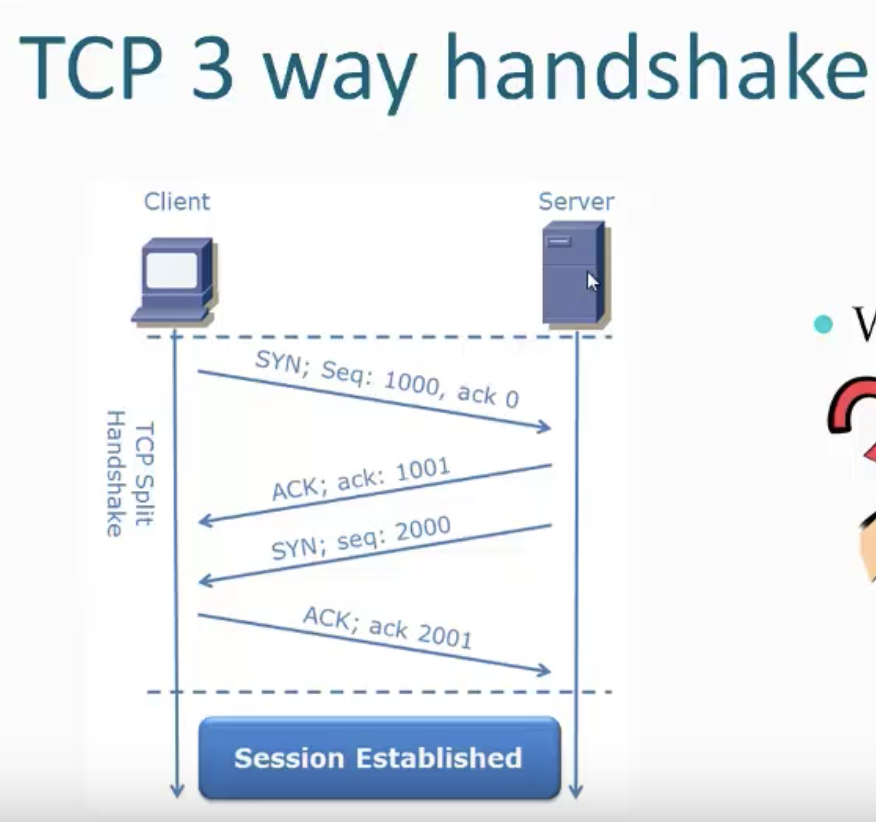
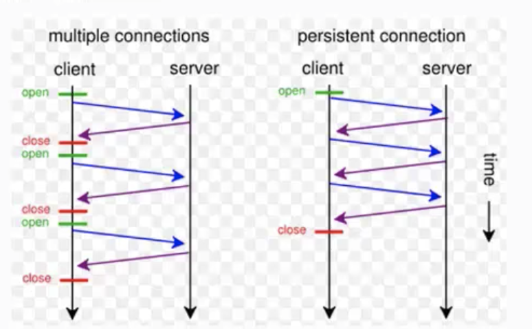
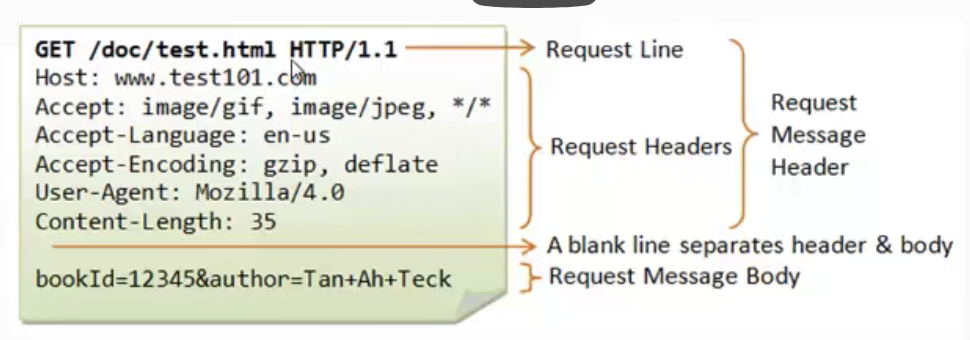

### HTTP Basics
- Networking protocol
- Default port 80 (Not mandatory).
- Current version is HTTP/2.0
- Underlying protocol is TCP
- It's a request/response protocol
- Application layer protocol

### Request and response
As mentioned, it's a request/response protocol on application layer.
When a client initiates a request it gets a response.
The first request that is sent is a TCP message (three way handshake). Only after this will a HTTP request be sent.

The HTTP Client (For example a web browser) sends a request message formatted according to the rules of the HTTP standard. A HTTP Request.
This message specifies the resource the client wants to retrieve and includes information to be provided to the server.

The server gets the request, interprets it and responds back. It reads and takes action to relevant to the request and creates an HTTP response message which it sends to the client. They are normally HTTP pages etc. The response indicates if the request was successful and provides the content if appropriate.

## TCP
The underlying protocol is TCP. This is chosen over UDP as it's more reliable and validates information, attempts to continue to send requests etc, this information allows HTTP to correct issues.

UDP is also directionless which is normally used on high data streams where data could be lost such as video streaming. If the data packet lost a chunk of a webpage, the whole page could be corrupted.

### TCP 3 way handshake



- When the client sends a request to the server, it sends a SYN packet with a squeuence number.
- When the server recieved the request, the server responds back with an ACK packet with the sequence number which has been incremented by one.
- The server now wants to ensure that the ACK pakcet was recieved by the client so it does the same to the client as the client did the server and sends a SYN request with it's own squence number and the client responds back with an ACK request, again with an incremented number.

Now the session is established.

### HTTP 1.1 vs HTTP 1.0
- Multiple Host Name Support
- Persistent Connections
- Byte Range Request
- Caching and Proxy Support
- More HTTP Methods

**Multiple Host Name Support**
The move from 1.0 to 1.1 allowed some big changes
Allowing multiple hosts meant you could host multiple allowed the concept of virtual hosting. Until 1.1, only one site could be hosted on one IP. The change to 1.1 saved a lot of IPV4 addresses.

**Persistent connection**
In 1.0 when connection is established, the server responds back and the TCP connection is stopped. Making another request means the handshake will happen again. This was a large overhead but 1.1 introduced Persistent connections to solve this overhead.

This works by when the client initiates request to the server, even after getting a response back, the pipe/connection remains unbroken and future requests can be done on the same pipe.

This made HTTP faster.

There's a few headers involved, one called "Keepalive" which determines the length of the connection's life.

If the connection remained forever, this would eventually use up all available threads on a server so after a certain amount of time, the connection is done. This we call a timeout/idle timeout which is normally about 300 seconds.

**Byte Range Request**
Byte range request allows the server to give chunks of data at once in a specific request rather than simply sending the entirety of the data in a single chunk.
A use case scenario of this would be a video on YouTube where you skip to 2 minutes into the video. It would be unnecessary to send the entire video in one single chunk and ask the client to simply pick out the data they want so Byte Range requests allow us to send a range of bytes instead.

### Persistent connections advanced
HTTP 1.1 allows a server and client to have a persistent connection as mentioned in the previous section.
The connection is only closed once the client has obtained all the data the client needs.


### HTTP Messages
All communication takes place via HTTP messages, request and response. They are text based but follow a specific format.

Our format follows the following structure:
```
<start-line>
<message-headers>
<empty-line>
[]<message-body>]
```

- The start line conveys the nature of the message.
- Headers to multiple things and are formatted as `<header-name>:<header-value>`
- Carriage return/line feed
- Message body is optional and is data for the server to use if needed

### Request message format
```
<request-line>
<request headers>
<empty-line>
[<message body>]
```
We can see the above format matches with the below HTTP request example.
The request line shows a `GET` which is our HTTP method, it contains the resource we want: `/doc/test.html` and the HTTP version being used which is `HTTP/1.1` which tells the server what the client is capable of and how to respond appropriately.

The request headers show a number of headers which the server is using to determine how it should respond.
- `Host` tells the server the host it's sending to
- `Accept:` Tells the server what content the client will accept
- `Accept-Language` shows the language the client will accept
- `Accept-Encoding` shows what compression we will allow
- `User-Agent` tells the server what client is making the request.
- `Content-Length` in a POST request this is mandatory but in a GET it is not.
- `Carriage return` is simply used to separate the body from the headers
- `Body` simply shows the data we send to the server. This could be anything.




### Response message format
