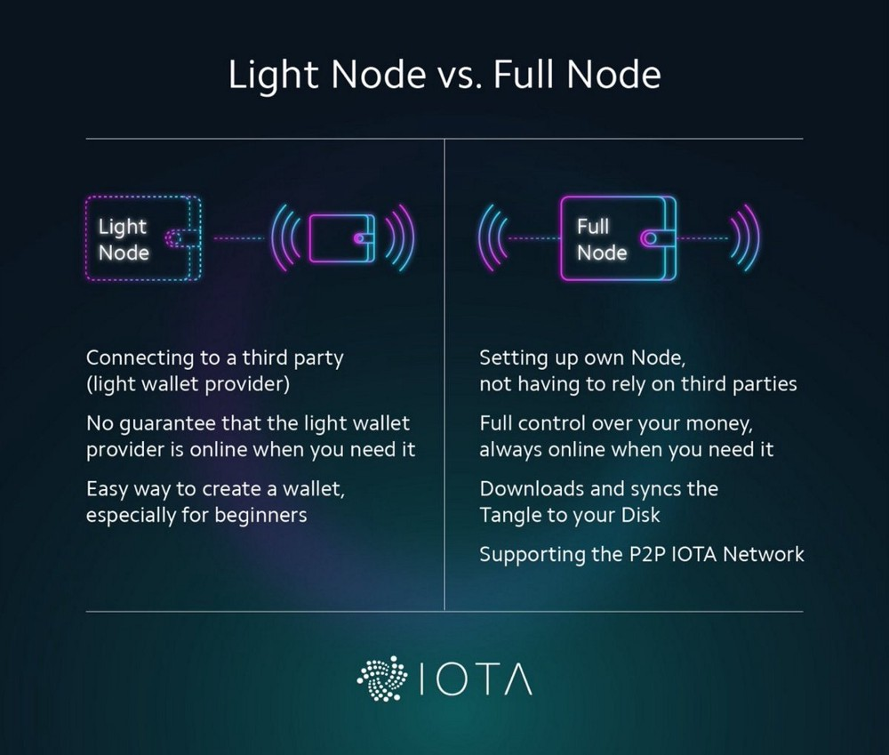

### Running an IOTA node

##### Types of nodes
- **Full node:** This is referred to as an IRI (IOTA Reference Implementation) running and being accessed locally via a GUI. This requires configuration to set up neighbor nodes via static IP addresses to function.
- **Headless node:** A full node which runs in a console. It has the same requiremenets as a full node but can open multiple user accounts (Seeds) at the same time.
- **Light wallet (GUI):** A local interface that just interacts with a full node using your seed. Full node examples: iotanodes.org, iota.dance

Below we see the difference between a light node and a full node:

Below are a list of reasons why you would want to run a full node (Source - http://www.tangleblog.com/2017/06/27/incentive-run-fullnode-iota/):
- You are aware of the fact that running the full-node is beneficial for the tangle topology and you want to help. (Yes, that exists)
- You have lots of transactions to make and don’t want to rely on a light node-server, as there is no guarantee that they are online when you need them.
- You have a web app running and need the stable connection
- You want to have maximum speed, so you choose the full-node
- You want to have a copy of the Tangle database, that is generated when using a full-node. (good for several reasons)
- In the future, maybe you provide a service and earn money for a full node.The only financial argument would be:
- You invested and want to support the Tangle as much as possible

##### Requirements:
You should have the following:
- 8GB minimum storage (30GB maximum required)
- 2 cores (Technically works with 1 but not recommended)
- 4GB of RAM

You should generally avoid running a node on a desktop computer if you want static neighbors (Unless using Bolero or only Nelson) because most of them are looking for nodes that run 24x7 without interruption and are synchronized. If your node goes offline, you will need to re-sync again on the next startup for your node. This is why 24x7 running nodes are preferred.

### CarrIOTA Nelson
Nelson is a tool to be used with IOTA's IRI node which automatically manages neighbors of your full node, negotiating connections, finding new neighbors and protecting against bad actors. Whilst running, Nelson will download an entry set of trusted Nelson peers for new Nelson instances.

More info: https://github.com/SemkoDev/nelson.cli

### CarrIOTA Bolero node
Another great addition from the SemkoDev team, CarrIOTA Bolero is a cross-platform desktop app which lets you start an IOTA full node with a single click using IRI and Nelson P2P. Because setting up an IRI is considered not so user-friendly, this takes a lot of the work off the user and automates it.

##### Requirements:
- Java 1.8.0_151 or higher installed
- If you are on windows, download and install the latest Visual C++from here: https://download.visualstudio.microsoft.com/download/pr/11100230/15ccb3f02745c7b206ad10373cbca89b/VC_redist.x64.exe
- Open/forward these ports on your router: 14600 UDP, 15600 TCP, 16600 TCP. CarrIOTA is working on UPnP tool to make this automatic.

##### Installation
Installation is as easy as it gets. Just download the executable, let it download the approx 5GB database then you are synced and ready to act as a full node.

CarrIOTA simplifies a lot of the deployment of an IOTA full node through Nelson which means you don't have to spend ages managing your neighbors yourself and makes running a full node easy for anybody without having to understand how configuring a node works.

### CarrIOTA field
Yet another great product from the SemkoDev team is not so much about setting up a node but more about what running a full node enables you to do. CarrIOTA field is a combination of a Client (IRI) and a server app.

Additional functionality includes:

- Provide anonymous node statistics to be able to visualize the whole IRI-Node network without compromising on security.
- Simplify node selection for light wallets
- Optimize node performance and usage of the node resources for the benefit of the whole network
- Hence, decrease the confirmation times and increase confirmations per second.
- Provide protection against DDoS attacks
- Incentivize node owners
- Add additional security through multiple confirmations for exchanges and critical applications.

Once you have a full node running, adding it to the field will provide you with the above benefits. It essentially acts as a proxy for IRI, sending it regular statistics about the IRI and it's neighbors, accepting connections only from the field server.

The server side is more complicated but we can see that on the website: http://field.carriota.com/

You cannot use the CarrIOTA field with Bolero but it will be integrated soon so everybody can participate. You can be under the CarrIOTA Field with Nelson or static neighbors. Each arrow represents one of your neighbors from your node that is on the CarrIOTA.
