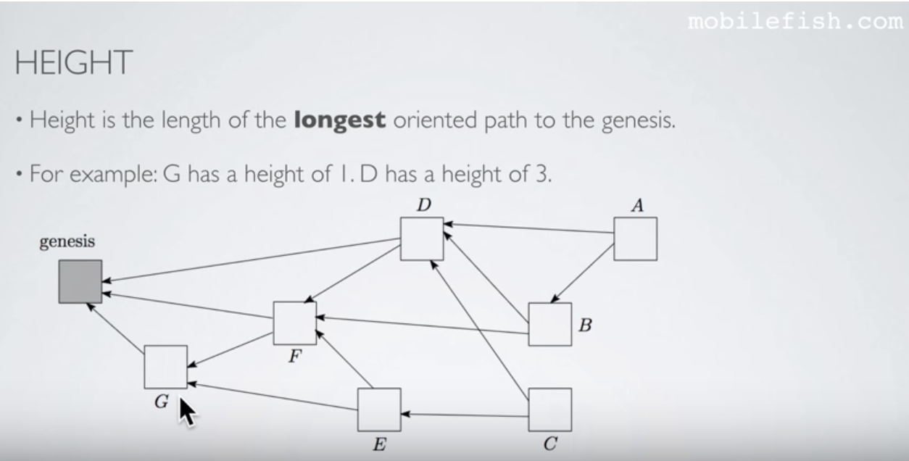
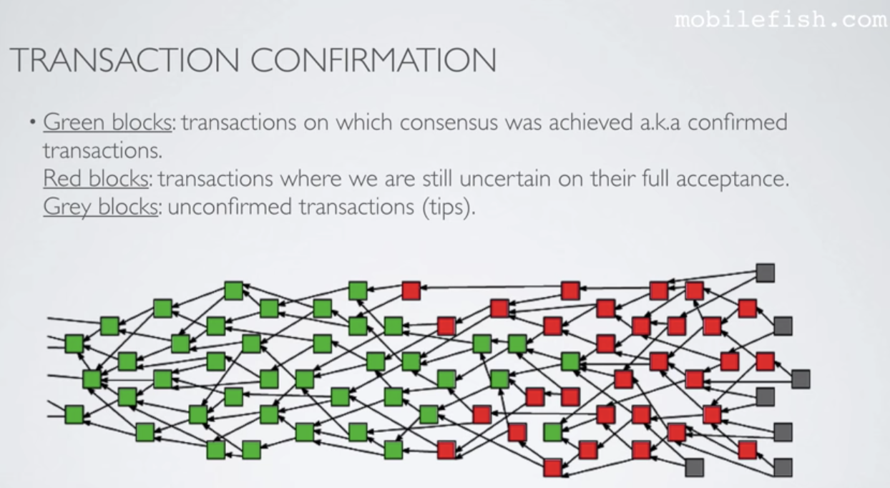
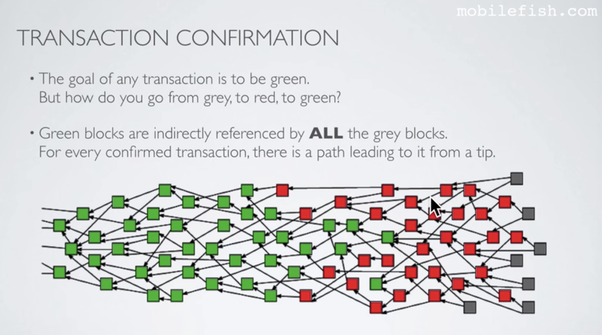
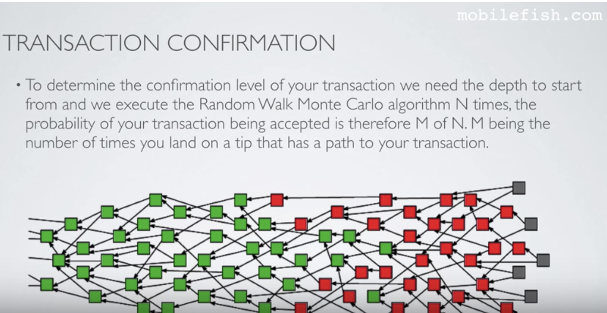
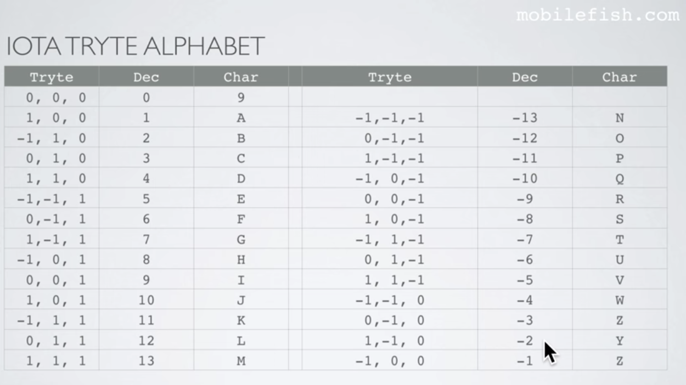
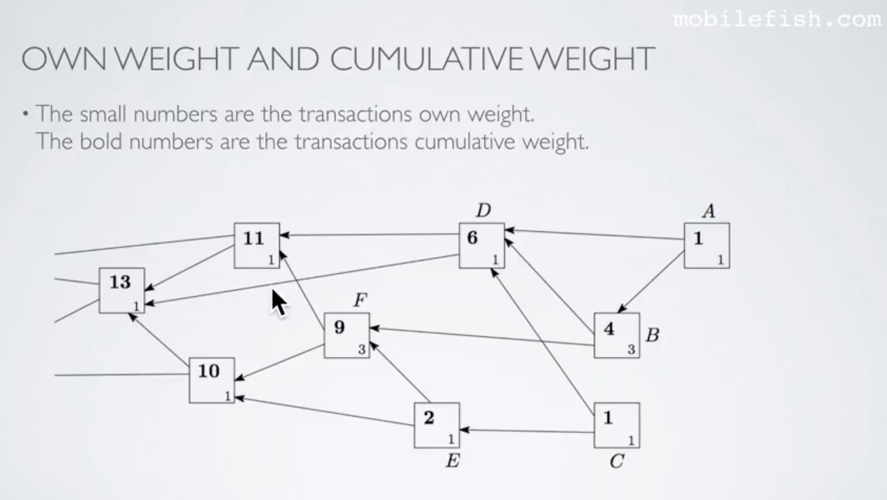
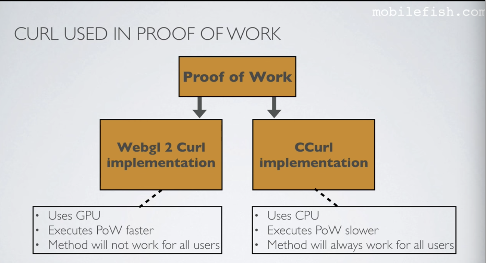
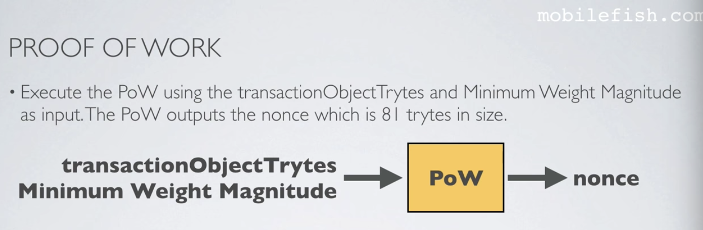
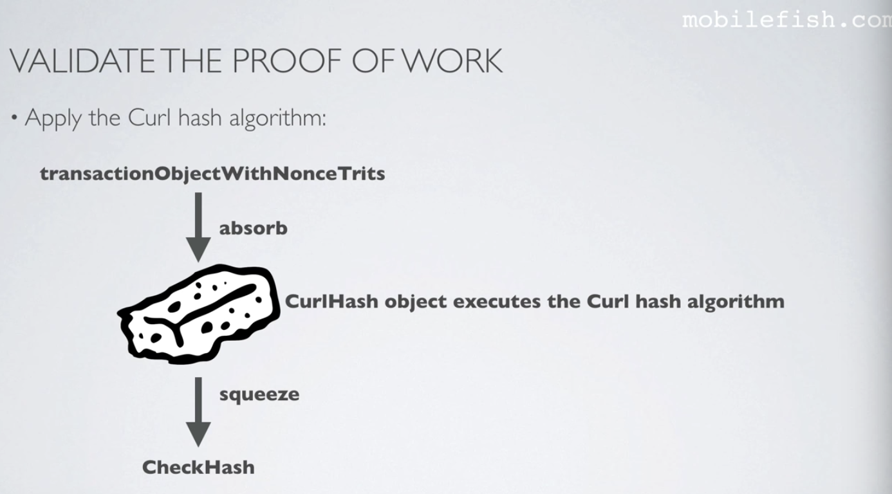

###IOTA Overview and terms

#### Tips
Tips are the unconfirmed transactions in the tangle graphs. They are transactions which have no other transaction referencing them but they have confirmed two other transactions

#### Height
Height is the longest oriented path to the genesis from a given transaction.
See the example below:

D has a height of 3 as the longest path it can take to the genesis block is 3.

#### Depth
Depth is the length of the **longest** reverse-oriented path to some tip.
See the image below:

In this case, G has a depth of 4 to Tip A. This always takes the longest path.

#### Making a transaction
This is a 3 step process:
* **Signing**: Your node (Device making the transaction) creates a transaction and signs it with your private key
* **Tip selection**: Your node selects two other unconfirmed transactions (tips) using the Random Walk Monte Carlos (RWMC) algorithm.
* **Proof of work**: Your node checks if the two transactions are not conflicting. After confirming this, you must do some Proof of Work by solving a cryptographic puzzle (hashcash). Hashcash works by repeatedly hashing the same data with a tiny variation until a hash is found with a certain number of leader zero bits. This PoW is to prevent spam and Sybil attacks. A Sybil attack is based on the assumption that half of all hash power is coming from malicious nodes.

#### Random walk monte carlo (RWMC) algorithm
The goal of the Random Walk Monte Carlo algorithm is to generate fair samples from difficult distribution.

The Random Walk Monte Carlo algorithm is used in two ways:
* To Choose two other unconfirmed transactions (tips) when creating a transaction.
* To determine if a transaction is confirmed.

#### How transaction confirmation is achieved.
The goal of any transaction is to be green (Confirmed). This means your transaction is committed completely.

* The green blocks represent a transaction which is completely confirmed.
* The red locks represent transactions which have not been fully accepted and confirmed
* The grey blocks are entirely unconfirmed tips.

Green blocks are indirectly referenced by ALL grey blocks (tips). For every confirmed transaction there is a path leading to it from a tip.

#### Transaction confirmation
To determine the confirmation level of your transaction, we need the depth to start from and we execute the Random Walk Monte Carlo algorithm N times, the probability of your transaction being accepted is therefore M of N. M being the number of times you land on a tip that has a path to your transaction.

For example, if you execute the RWMC method **100 times** and **60 tips** have a path to your transaction then your transaction is 60% confirmed. It is up to the merchant to decide to accept the transaction and exchange goods. It is the same as Bitcoins where you want to wait for at least 6 blocks for high value transactions. Transactions with bigger depths takes longer to be validated.

#### Tangle partitioning
A tangle can branch off and back into the network. This is called partitioning. For example, sensors on containers on a freighter ship loses connectivity with the main tangle when the ship travels over the ocean. The sensors can create an offline tangle cluster.

#### Coordinator
The Coordinator (Coo for short) are several full nodes scattered in various secret locations in the world run by the IOTA foundation. It creates zero value transactions called milestones which full nodes reference to.

It's main purpose is the protect the network in it's infancy stage to sustain against a large scale attack. The Coordinator sets the general direction for the tangle growth and do some kind of checkpointing.

The network is considered decentralised because every node verifies that the Coordinator is not breaking consensus rules by creating IOTA out of thin air of approving double spendings.

When the amount of organic activity on the IOTA ledger is sufficient where it can run itself, the Coordinator will be turned off.

#### Snapshotting
A snapshot is a method which keeps the ledger database that devices have to keep very small in size.

Snapshotting groups several transfers to the same address into 1 record, saves only non-zero balances and removes transaction history.

The addresses with balances act like new genesis addresses but no previous history or data will be attached.

Currently snapshots are done manually by the IOTA network but this will be automatic in future.

There will be perma nodes which store the entire tangle history and data permanently and securely

#### KECCAK-384 / KERL
IOTA created their own hash funtion called Curl based on SHA-3/Keccak.
Curl was then replaced by the Keccak-384 hash function and renamed this "kerl".

### Trit and tryte
#### Trinary numeral system
The trinary numeral system has two types:
* **Balanced trinary system:** Which is a trit containing values -1, 0 and 1.
* **Unbalanced trinary system:** which is a trit containing values 0, 1 and 2.

We will only focus on the **balanced trinary system**.
* A trit is a Trinary Digit, analogous to bit and has the following values: -1, 0 and 1.
* Tryte means Trinary Byte analogous to Byte. A tryte consists of 3 trits.

#### Conversion in Trinary
* 1 byte = 2^8 = 256 combinations
* 1 tryte = 3 trits = 3^3 = 27 combinations
* 5 trits = 3^5 = 243 combinations
* *5 trits is NOT equal to 1 byte.*

#### Conversion of trinary into integer
If we want to convert tryte: **-1, 1, 0** into an integer (Bold numbers are from values from our tryte):
**-1** x 3^0 + **1** x 3^1 + **0** x 3^2 = 2

Another example, convert tryte **1, -1, 1**:
**1** x 3^0 + **-1** x 3^1 + **1** x 3^2 = 7

First, we read from **left to right** whereas with binary, we read from right to left.

#### Maximum value
The maximum value a tryte can have (Not the number of combinations) is **14**.
If you thought 3^3 - 1 = 26 then you are thinking in the binary system. If you have 2 bits in a binary system, you have the following combinations:

* 00 = 0x2^1 + 0x2^0 = 0
* 01 = 0x2^1 + 1x2^0 = 1
* 10 = 0x2^1 + 0x2^0 = 2
* 11 = 0x2^1 + 0x2^0 = 3

Max value = 2^2 -1

If you have **2 trits** in a balanced trinary system, you have the following combinations:

* 0, 0 = 0x3^0 + 0x3^1 = 0
* 0, 1 = 0x3^0 + 1x3^1 = 3
* 0, -1 = 0x3^0 + -1x3^1 = -3
* 1, 0 = 1x3^0 + 0x3^1 = 1
* 1, 1 = 1x3^0 + 1x3^1 = 4
* 1, -1 = 1x3^0 + -1x3^1 = -2
* -1, 0 = -1x3^0 + 0x3^1 = -1
* -1, 1 = -1x3^0 + 1x3^1 = 2
* -1, -1 = -1x3^0 + -1x3^1 = -4

These are all the combinations you can create with two trits. The two trits are the first two values in the equations above. The corresponding decimal values are on the right.

You will notice we have positive and negative values. The values in the Trinary system are balanced around zero:
**-4, -3, -2, -1, 0, 1, 2 ,3 ,4 Max value = (3^2) / 2**

A tryte has **3 trits** so the maximum value will be (3^3 - 1) / 2 = 13 and it has 3^3 = 27 combinations.
A tryte's values range from -13 to 13 for a total of **26 combinations** and a *Minimum value of -13** and a **Maximum value of 13**

Now let's convert two trytes to an integer. Our 2 trytes contain 6 trits (3 trits per tryte) so we convert per tryte (3 trits) and add the two integers:

Converting **-1, -1, -1, 1, 0 ,0** to an integer:

The exponent values represent the positions of each trit in the tryte starting with an index of 0.

**-1** x 3^0 + **-1** x 3^1 + **-1** x 3^2 `+` **1** x 3^3 + **0** x 3^4 + **0** x 3^5

Answer: -13 `+` 27 = **14**

If you calculate the first tryte, you will get the value of *-13* and if you calculate the second tryte you will get the value *27*. Add these together to get an overall value of **14**.

IOTA uses the balanced trinary system. To make this more human readable, the IOTA development team created the tryte alphabet: 9ABCDEFGHIJKLMNOPQRSTUVWXYZ which contain 26 letters of the Latin alphabet plus the number 9 for a total of 27 characters.

Because 1 tryte has 3^3 = 27 combinations, each tryte can be represented by a character in the tryte alphabet:

IOTA seeds, addresses, hashes etc are trytes which are represented by characters from the tryte alphabet.

An IOTA seed contains 81 characters which is the same as 81 trytes. Each tryte has 27 combinations which means an IOTA seed has 27^81 combinations. This is an extremely large amount.

### Own Weight, cumulative weight, minimum meight magnitude
#### Own eight and cumulative weight
Every transaction has an initial weight called own weight and can have the values 1, 3, 9 etc (3^n).

The own weight is determined by the effort put by it's ussing node. This is not important to know how this is calculated.

The cumulative weight of a transaction is the transaction own weight plus the sum of all weights of all transactions that directly or indirectly approve this transaction.

In the diagram below you can see the own weights of each transaction is the small number and the bolt numbers are the transactions cumulative weight.

**Cumulative weight** are a very important metric for transactions on it's way to network approval.

A transaction with a larger cumulative weight is more "important" than a transaction with a smaller cumulative weight.

Each new transaction added to the tangle increases the ancestors cumulative weight by the weight of that transaction. Older transactions grows in importance over time.

The use of cumulative weights avoid spamming and other attack styles, it is assumed that no entity can generate an abundance of transactions with "acceptable" cumulative weights in a short period of time.

#### Minimum weight magnitude
The minimum weight magnitude is the difficulty of Proof of Work.

IOTA's proof of work algorithm is similar to Hashcash.

The minimum weight magnitude is the number of training zeroes.

A simplified explanation of how Hashcash works:
If we assume MWM=4

If we hash the value below and we check the trailing 4 digits, the proof of work is not ok:
`hash(transaction data + counter) = ...9f86d081884c7d659 (PoW not ok)`
We then increase the counter by 1, re-hash and check the hash again:
`hash(transaction data + counter) = ...884633bce1d660000 (PoW ok)`
As we can see, the last 4 characters were 0000 which depending on the minimum weight magnitude (basically the difficult) would likely result in the PoW being considered acceptable.

Currently on the mainnet, the minWeightMagnitude = 14 (Applies to IRI Release v1.4.1.2). This means a hash should have 14 trailing zeroes to complete the proof of work.

On the testnet the minWeightMagnitude = 9 (Applies to IRI release: testnet-v1.4.1.2).

Higher minWeightMagnitude values should be no problem but will just cause the Proof of Work to take longer unnecessarily

The minimum weight magnitude changes. See file Configuration.java.
For example:
https://github.com/iotaledger/iri/tree/v1.4.1.2/src/main/java/com/iota/iri/conf/Configuration.java
Inside this file, we can scroll down and see the the Minimum weight magnitude:
`conf.put(DefaultConfSettings.MAINNET_MWM.name(), "14");`

### Snapshots and attaching to the tangle
A snapshot is a method to reduce the size of the Tangle database by removing all transactions from the Tangle, leaving only a record of addresses with corresponding balances. Addresses with zero balance are also removed from this record.

A snapshot is simply a list of every address with corresponding non-zero balance.

This list can be found in the IOTA reference implementation (IRI):
https://github.com/iotaledger/iri/blob/dev/src/main/resources/Snapshot.txt

These addresses with balances acts like a genesis address.
Once the snapshot is successfully performed you may need to claim your tokens.

Claiming means you need to transfer your tokens from the old Tangle database (before the snapshot) into the new Tangle database (after the snapshot). If you forget to claim your tokens you will never be able to get access to your tokens again.

The claiming process is only needed when there are major design changes in the IOTA protocol so claiming after a snapshot may still occur.

#### Deterministic wallet
An IOTA wallet is a deterministic wallet, meaning when a new address is generate, it is calculated from the combination of the seed and address index where the address index can be any positive integer.

The wallet starts from address index 0 and asks the node it is connected to, for a list of transactions that incorporate that address.

If there are no transactions found referencing that address, the wallet concludes that it has not used that address yet. The wallet will not increase the address index and shows the total balance of all the addresses found.

If there are transactions found referencing that address, the wallet will increase the address index which is turn creates a new address. The wallet again searches the Tangle for transactions referencing that new address.

The wallet will skip any address index where it sees that the corresponding address has already been attached to the tangle.

#### Attaching to the Tangle
When you attach an address to the tangle, it creates a zero-value transaction referencing that address. This is a normal transaction of zero value so it chooses and validates two transactions from the Tangle and then does the Proof of Work.

When generating addresses, the outcome is deterministic. When using a seed plus the index of 0, you will always get the same address as an output.

You should NEVER send IOTA to an address which has not been attached to the tangle.

First it starts with index 0 to get the corresponding address. Next it sends this address to the node and asks if it's used. The node checks the tangle and does not find a transaction with that address meaning it is not attached to the tangle. The wallet will not continue with the next address index.

After a snapshot, all addresses with a value of zero will be deleted.

#### Why you should never re-use an IOTA address for outgoing transactions:
Digital signatures are used for authentication, integrity checking and non-repudiation.

Development of quantum computers threatens the security of currently used digital signature algorithms such as RSA and ECDSA.

Cryptographers developed a variety of quantum resistant alternatives of which hash based signatures are most promising.

Hash based signatures are based on so called One Time Signatures (OTS). The term implies that a single public/private key pair must only be used once. Otherwise, an attacker is able to reveal more parts of the private key and spoof signatures.

##### Lamport one time signatures scheme
Leslie Lamport created a method to construct digital signatures using only cryptographically secure one way hash functions. This method is called the Lamport signature scheme.

Other one time signature schemes are the Merkle OTS and Winternitz OTS.

The Lamport one time signature scheme is a very easy to understand scheme and **Very loosely** comparable to Winternitz OTS.

The Lamport OTS scheme reveals half of the public key and half of the private key. This means each time a transaction is re-used, your probability of your private key being bruteforced drops from 1/2^256 to 1/2^128 and if used for a third time would drop to 1/2^64 and so on. The more the address is used, the more of your private key you give away and the more chance somebody has of bruteforcing your private key.

#### Proof of work, Curl and Nonce
##### Curl
In the IOTA light wallet you can choose between the CCurl implementation or the WebGL Curl implementation.

To understand what Curl works, we need to re-visit making a transaction.

This is a 3 step process.
1) Constructing the bundle and signing the transaction inputs with your private keys. IOTA uses a bundle which consists of multiple transactions containing credits to the receiving addresses (outputs) and debits from the spending addresses (inputs).

In IOTA there are two types of transactions. One with a value where you have to sign inputs and one where you simply send a transaction to an address with no value transfer (Eg data). A bundle represents only a transfer of value.

A transaction is an object containing several fields such as an address, signature, value and tag.

2) Tip selection is a process whereby you traverse the tangle in a random walk to randomly choose two transactions which will be validated by your transaction. Your transaction checks for example if the descendants of that transaction is valid. If these transactions are valid they will be added to your bundle construct and are called branchTransaction and trunkTransaction.

3) Proof of Work. Once the bundle is constructed, signed and the tips are added to the bundle the PoW has to be done for each transaction in the bundle. Every transaction in a bundle requires a nonce (this is the result of the PoW) in order to be accepted by the tangle network.

IOTA's PoW is directly comparable to Hashcash, as it serves a similar purpose to prevent spam, and in IOTA's case also prevent sybil attacks.

When the PoW is done, the nonce of the transaction object should be updated. The transaction can now be broadcasted to the tangle network and wait for it to be approved by someone else.

Now let's continue looking at **curl**.
The IOTA team created their own cryptographic hash function called Curl. This hash function is used for a number of purposes in IOTA but we will only be looking at the **usage** of Curl in the context of PoW.

The IOTA light wallet uses the Curl hash algorithm for PoW. This is where our two methods come in:

##### Using WebGL 2 Curl implementation
The IOTA light wallet is built using the Electron framework. Electron combines Chromium and Node.js into a single app which can be packaged for Mac, Windows and Linux. The Curl hash algorithm is ported to Javascript (curl.lib.js) to work in WebGL0enabled browsers like Chromium. Web Graphics Library (WebGL) is a Javascript API for rendering interactive 2D and 3D graphics within any compatible web browser. See

##### CCurl
CCurl is the C port of the Curl Library which uses the system CPU. PoW is executed faster using GPU's instead of CPU's.

By default the IOTA light wallet uses the WebGL 2 Curl implementation thereby speeding up the PoW however some people will find that they get an "Invalid transaction hash" when they use this setting. In this case, select the light wallet option "CCurl implementation".

CCurl implementation means using the C curl library for the PoW.

#### Proof of work
Proof of work means calculating the nonce for every transaction in a bundle. This is used to prevent spam and sybil-attacks.

Even though IOTA is free to use, you must pay a small cost of the electricity required to calculate the nonce and complete proof of work.

To see how Proof of Work is done, we need to get the Minimum weight magnitude (MWN). As mentioned previously, this controls the difficulty and determines how many 0's are needed to complete the PoW.

An IOTA transactyion data is encoded and stored in a string of **2673** trytes (= transactionObjectTrytes).

The last 81 trytes of the transactionObjectTrytes is **reserved** for the nonce. More information on the anatomy of a transaction can be found at https://iota.readme.io/

Once the nonce is found using PoW, insert the nonce in the transactionObjectTrytes (= transactionObjectWithNonceTrytes).

##### Validating the proof of work
Convert transactionObjectWithNonceTrytes into trits (= transactionObjectWithNonceTrits)

Create and initialise a CheckHash object (type: Int32Array(243)). This object will hold the Curl hash algorithm result.

Create and initialise a CurlHash object (type: Int32Array(3x243))
This object will:
- Recieve inputs (absorb the transactionObjectWithNonceTrits)
- execute the Curl hash algorithm
- outputs the result (squeeze data into the CheckHash object)

To help explain/clear this up see the image below:

The sponge represents the curl hash object which will execute the curl hash algorithm.

The CheckHash object will hold the Curl hash algorithm result in trits. The number of 0's at the end of the CheckHash value must be at least the Minimum Weight Magnitude. If that is the case, the nonce is valid.

A valid nonce is required for the transaction to be accepted by the tangle network.

To see an example of PoW being completed, watch the following video at 10m6s.
https://youtu.be/EEgpt2EsLh4?t=10m6s

#### Cryptographic sponge construction
IOTA uses the cryptographic sponge construction to create addresses and address checksums.

This is a simplified explanation for software developers.

A sponge construction of sponge function takes input bit data of any length (message) and produces an output bit data of any desired length (Hash digest). Simply said, the data is absorbed into the sponge then the result is squeezed out.

The sponge function has two phases. The absorbing phase in which the message is compressed iteratively followed by the squeezing phase in which the hash digest is extracted in an iterative manner.

