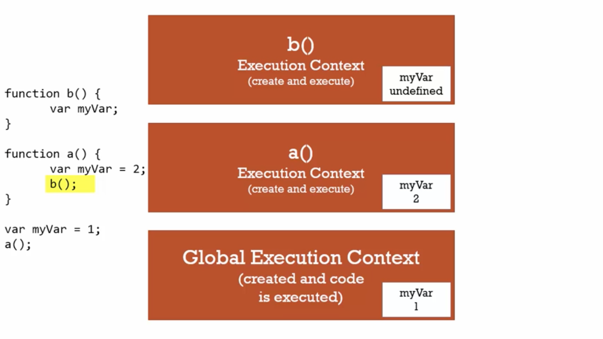
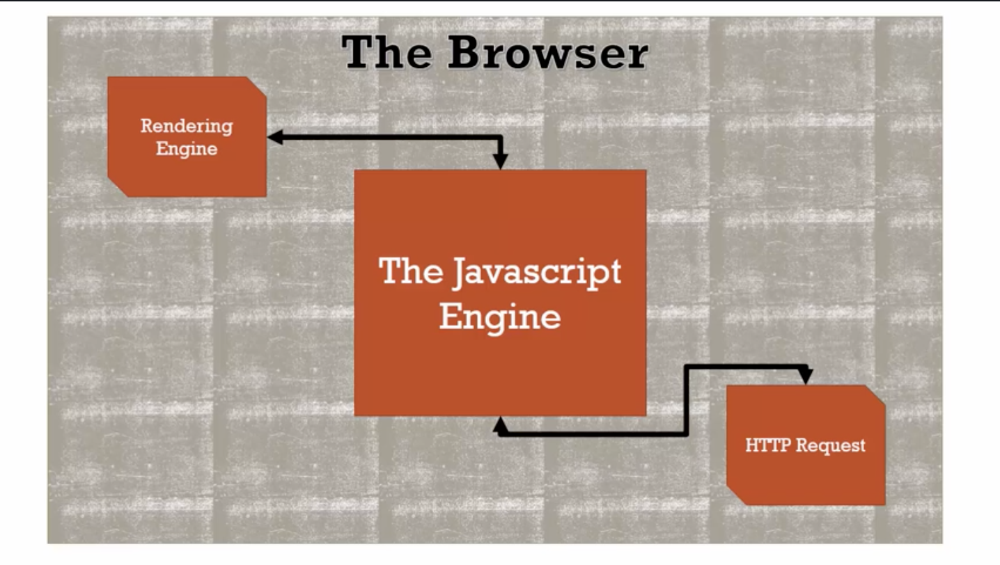
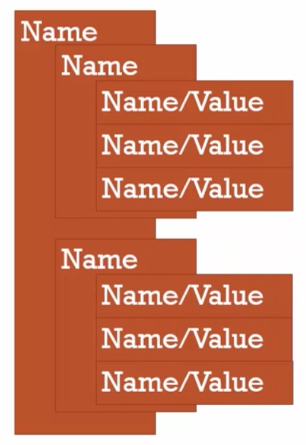
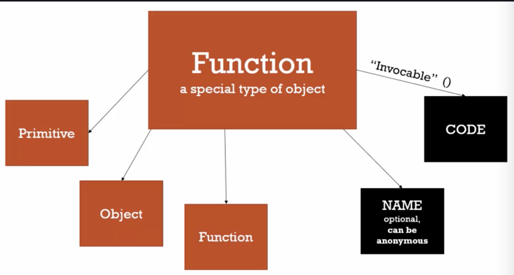
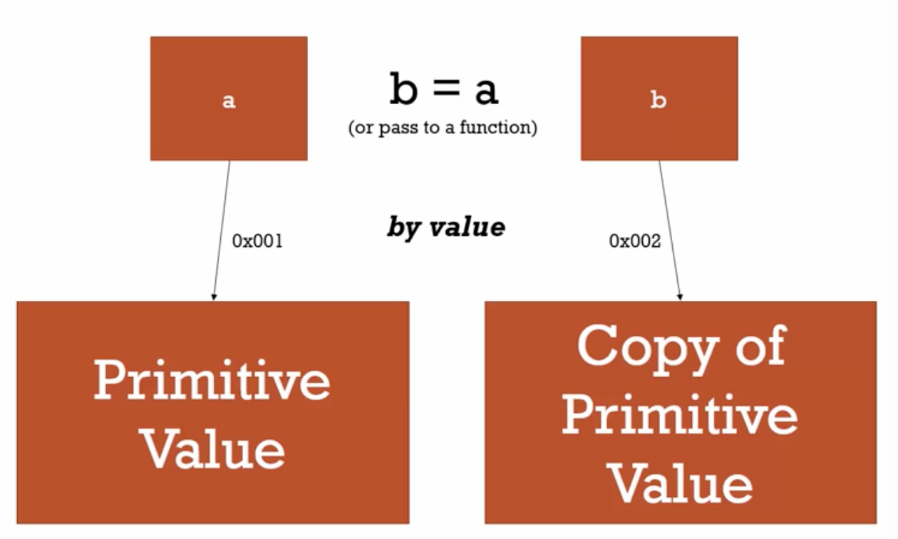
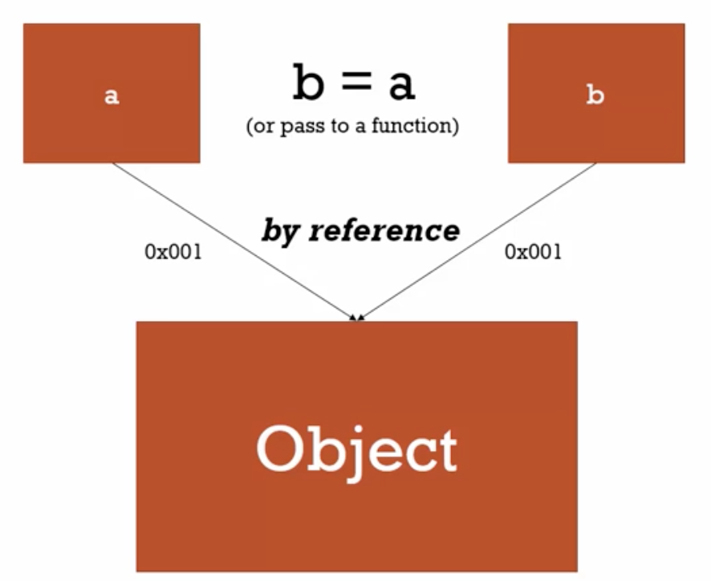

---
export_on_save:
  html: true
---

### Execution context

Given the following code:
```javascript {cmd="node"}
b();
console.log(a);

var a = 'hello world';

function b(){
  console.log('Called b');
}
```

In most programming languages, this would not properly run as you cannot call a function before it has been created. In Javascript this is not the case.
As such, this returns the following output:

```
called b
Undefined
```

### Hoisting

If we were to remove the line `var a = 'hello world';` we would actually see an error `Uncaught ReferenceError: a is not defined`.

This is called "Hoisting".

The execution context is created in two phase. The first phase is the creation phase where the Global Object and `this` are both created. `this` is always created within an execution context.

During this phase, as the parses parses your code to set up what you've written, it sets up the memory space for the variables and functions. It's this step which is referred to as hoisting. The name indicates (And many explain this in this way) that the code is being hoisted to the top of the code to be executed first. In actual fact, hoisting just refers to this memory reservation in the creation phase.

During the creation phase, the parser will identify functions and where variables should exist. The *assignment* of values to variables is done during the execution phase only (when the code is being executed).

All variables start as `undefined` in javascript during the creation phase and functions are held in memory in their entirety.

This is why you want to avoid relying on hoisting. It is best to stick to traditional programming practices and creating things in the right order.

### Undefined

We've already seen there's a first phase of creating an execution context where there's a global object, `this`, a reference/link to the outer environment and hoisting where variables are initially set to undefined. But what does this mean?

Using the following code as reference:
```javascript {cmd="node"}
var a;
console.log(a);
```

This will return `undefined` when run.
As we saw before, if we remove the line `var a;` we will get an error instead saying `a is not defined`.

Being undefined and not defined are two different things in Javascript. When we see `undefined` in Javascript, it isn't simply a string `undefined` it's actually a special value that Javascript has that means the variable hasn't been set to any value but exists in memory. As such, `undefined` does not need to be used in quotations as it is it's own special value in Javascript.

When a variable isn't declared, it gives an error as it is saying there is no memory allocated for that variable.

Never set a value to `undefined`. It's perfectly valid Javascript but it's dangerous. It should ALWAYS mean that you never set the value.

### Execution context: Code Execution
As mentioned, there are two phases when running Javascript. First is the creation phase and second is the execution phase.

In the execution phase we already have all the things we had before but now during the execution phase, it runs your code line by line.

### Threading
#### Single threaded
Single threaded execution means you're only dealing with one line at a time. Javascript behaves in a single threaded manner and should be treated as single threaded even if under the hood (The client itself) it's being run multi threaded.

#### Synchronous
Synchronous means it's being run one line of code at a time. Javascript is run in single threaded synchronous manner.
This obviously is different when it comes to AJAX (Will discuss later) and node.js.

### Function Invocation and the execution stack
Invocation just means running/calling a function. When we say we invoke a function we are just referring to the calling the function like `myfunction()`.

Look at the following:

```javascript {cmd="node"}
function b(){

}

function a(){
  b();
}

a();
```

When this is run, it creates a global execution context and completes it's two phases as mentioned earlier but also each time we invoke a function, we are moving straight into invoked function and a new execution context is created for each function which means each function that gets invoked will go through both initial phases of creation and execution and will get it's own `this` and global object.

This is how function invocation in Javascript works and this is called the *Execution stack*.

You an imagine the execution stack like an actual stack where the function on top is the current function that is being run and is removed once the function has been completed.

For example, in that code, when function a() is called, a new execution context is created and "Stacked" on top of the global execution context. This then invokes another function before being completed which is `b()` and therefore the `a()` execution context is not removed from the stack but a new execution context is put on the top of the stack which is `b()`. Once all code in that context has been run, it is removed from the stack and continues running a from where it left off when it invoked the last function.

The lexical position of the code in the page does not matter in this regard. Javascript will only care about the order in which functions are being invoked.

Even if a function is invoking itself, it will create a new execution context to place on top.

### Variable Environment
A variable environment refers to where the variable lives and how it relates in memory.

When you think about "variable environment" think about "Where is the variable?"

If we look at the image below:



For each execution context, we can see that the variable myVar gets its own dedicated store in memory per execution context. They do not share the same section in memory.

We can also see that in function b() myVar is equal to undefined. This is due to **scope** which essentially defines where we can see the variable. Each variable we're looking at is defined in it's own execution context as it's all in it's own function. Even though myVar is created 3 times, they are 3 distinct times which do not see each other and will never interact.

### Scope chain
Look at the following code:
```javascript {cmd="node"}
function b(){
console.log(myVar);
}

function a(){
  var myVar = 2;
  b();
}

var myVar = 1;
a();
```

In this situation, we get `1` as an output to this.

The reason for this is due to the scope chain. When we do something with a variable, Javascript will do more than just look in it's current execution context. We need to remember that every execution context (Aside from global) has a reference to it's outer environment.

In the case of the above code, even though function b() is 1 step above function a() in terms of execution contexts, the outer execution context is the global execution context due to the fact that the variable has been created inside of the global execution context. How it gets invoked/what order does not matter in this situation.

In Javascript, when trying to use a variable inside of an execution context, if it cannot find one in it's current execution context, it will go to it's outer execution context to check if it exists there. It will keep going through outer environments until it either cannot find an outer context (If you're in global context) or it finds the variable you are looking for in an outer execution context.

This whole chain of outer environment references is called the **Scope chain**.

To show this, if we look below:
```javascript {cmd="node"}
function a(){

  function b(){
    console.log(myVar);
  }

  var myVar = 2;
  b();
}

var myVar = 1;
a();
```
Note that if we were to put `b();` at the bottom line after `a();` we would get an error saying `b();` was not defined. This is because `b();` does not lexically sit in the global execution context like a() does. In order to get to `a();`, we must be inside of the execution context that it lives in which in this case would be `a();`

This code will now return `2` as the first execution context from `b();` where myVar is being requested is `a();`'s execution context.

### Scope, ES6 and let
Scope is just where about in your code a variable is available and if it's truly the same variable or a new copy.

In ES6, we are allowed to use a new way of declaring variables using the keyword `let`.

let allows us to do something called block scoping. See the code below:
```javascript {cmd="node" output="none"}
if (a > b){
  let c = true;
}
```
The difference with using let over var is that although it is still being put into memory during the creation phase just like `var`, it cannot be used until the line of code is run during the execution phase that actually declared the variable.

Another thing to note is that it's declared inside a block. A block is just an area of code between curly braces such as an if statement or for loop. When that variable is made in that block, it is ONLY available in that block. This is true also inside for loops. If you have a loop which is going through a for loop over and over, you will actually get the same variable re-created over and over in memory. This allows for block scoping.

### Asynchronous Javascript
Asynchronous simply means "More than one at a time". Javascript in the browser is synchronous but there are events such as click events and data retrieval which are asynchronous.

##### How is asynchronous possible in a browser?

To understand this, we need to understand the Javascript engine itself. When we're talking about running Javascript, we aren't just talking about the Javascript engine itself. The Javascript engine is just part of a web browser which makes up a user experience on a webpage. There are other parts which make this experience for the user and Javascript has hooks into them. See the image below to see two other parts of a web browser that the Javascript engine can interact with via it's hooks whilst the Javascript engine itself runs synchronously.



##### How can we use asynchronous code?
Just as we saw with the execution stack, there is another list we call the **Event queue**. This is full of events/notifications of events that might be happening. When something happens that we might want to be notified of, it gets placed in an event queue. A click event for example. If we have a function that should respond to a click event or HTTP request, these requests are listened for and any time an event is fired it's put into the event queue stacked on one each other.

The event queue does not get processed until there is nothing left in the execution stack. Until Javascript is finished running all the code in the execution stack, the event queue will not be processed. One the stack is empty, the first event in the event queue will be run and will create new execution contexts for functions that handle that event and only when those newly created execution contexts in the stack are processed will it move onto the next event in the event queue and continue it's process.

We can understand the synchronous nature and how these stacks relate with the following code:

```javascript {cmd="node" output="none"}
// long running function
function waitThreeSeconds() {
    var ms = 3000 + new Date().getTime();
    while (new Date() < ms){}
    console.log('finished function');
}
˜
function clickHandler() {
    console.log('click event!');
}

// listen for the click event
document.addEventListener('click', clickHandler);


waitThreeSeconds();
console.log('finished execution');
```
The above code creates a timer when the Javascript gets loaded that waits 3 seconds before completing the function. As a result, due to being synchronous, this means that the code will block the execution of even an asynchronous action such as a click event until the execution stack is completely clear and the 3 second timer is done.

### Types
*Dynamic typing* is where we don't tell the engine what type of data a variable holds, instead it's figured out as it's running. A variable can hold different types of data in the same variable.

In other languages, *static typing* is used where you define what data type goes into a variable and data that isn't of the type originally declared cannot be stored in that variable.

### Primitive Types
There are 6 primitive types. A primitive type is a type of data that represents a single value. In other words, something that isn't an object (Collection of name pairs).

| Data Type | Description                                                                                                                                |
|-----------|--------------------------------------------------------------------------------------------------------------------------------------------|
| Undefined | Represents a lack of existence. We should not set this value ever as we should let the engine set this value.                              |
| Null      | Also represents a lack of existence. We should use this to set something to nothing instead of undefined.                                  |
| Boolean   | True or false                                                                                                                              |
| Number    | A floating point number meaning there is always some decimals attached to it. Unlike other languages, there's only floating point numbers. |
| String    | A sequence of characters                                                                                                                   |
| Symbol    | Used in ES6 and is being constructed and is not yet supported in all browsers. We will ignore this for now - Just know it exists.          |

### Operators
An operator is a special function that is syntactically (written) differently to a traditional function. Normally taking two parameters to return one result.

Operators are essentially functions that can be called in a very short hand for example if doing `5 + 5;` we can write in "Infix" notation meaning we put the operator in the middle of parameters. It's a very shorthand way of calling a predefined function Javascript has to add two numbers together.

#### Operator precedence and associativity
Operator precedence just means which operator function gets called first when there's more than one on the same executable code. The higher precedence wins and will be executed first.

Operator associativity is what order the operator will get called in. This is when an operator has the same precedence as each other. At this point, depending on the associativity of the operators the engine will decide to run left-right or right-left.

An example of where this is important: In Mathematics in general, there's a mathematical precedence associated with mathematical operators and therefore Javascript will need to ensure that a calculation such as `5 + 5 * 3` is executed in the correct order as it should be in Mathematics. This is where operator precedence comes in.

https://developer.mozilla.org/en-US/docs/Web/JavaScript/Reference/Operators/Operator_Precedence

Above is a link showing a table of all operators in Javascript and their precedence and Associativity. The `...` around the operators are just other code.

If we have two operators with the same precedence, Javascript will need to use associativity to understand in which way the code should be executed.

Take the following example:
```javascript {cmd="node"}
var a = 1, b = 2, c = 3;
a = b = c;
console.log(a);
console.log(b);
console.log(c);
```

If we check the output of this, we can see that 3 is returned all times. If we check the MDN linked above we can see that associativity for the `=` operator is right-left meaning we start from the right of the line and execute left.

As mentioned earlier, assigning operators generally take 2 parameters and return a value. This is also true in assignment. If we do `b = c` this runs a function (Called shorthand by the operator `=`) and returns the value that is being assigned.

##### Grouping
It is worth nothing that parenthesis `()` are the highest possible precedence meaning everything inside it will be run first before everything else. This is useful for ensuring your code is executed in the correct order.

### Coercion
Coercion is when you are converting a value from one type to another. This happens a lot in Javascript due to being dynamically typed.

If we look at the following code:
```javascript {cmd="node"}
var a = 1 + "2";
console.log(a);
```
We can see that this outputs as 12 thanks to Javascript's type conversion. This is because 1 was automatically converted to a string. This was chosen by the engine and not specified by the user. Javascript knows it's impossible to add a number and a string together so to allow this operation to take place, 1 will be automatically converted to a string.

### Comparison operators
#### Quirks
Examine the following code:
```javascript {cmd="node"}
console.log(1 < 2 < 3);
```
This returns true which is what we would expect as 3 is greater than 2 which is greater than 1. This is a true statement and should return true.

However, looking at the following code:
```javascript {cmd="node"}
console.log(3 < 2 < 1);
```
This should return false as 1 is not greater than 2 which is not greater than 3. But it returns true.
The reason for this is that using an operator `<` returns a boolean true or false. If we look at the precedence table, we can see that the associativity of the `<` operator reads left to right.
This means that after the first operation is completed we are running the following:

```javascript {cmd="node"}
console.log(false < 1);
```
Going from left to right (as we should do for this associativity) we can see this returns the boolean of false. Now due to Javascript's automatic type conversion, false is converted to a number which actually is converted to `0`. For reference, converting a boolean `true` will return `1`.

We can see this by running the following:
```javascript {cmd="node"}
console.log(Number(false));
console.log(Number(true));
```

This means our original execution now reads as if it is written:
```javascript {cmd="node"}
console.log(0 < 1);
```
Which we know is true and returns true. This is why this shows as true even though from our human perspective this seems abnormal.

#### Equality operator
The equality operator returns a boolean and will check the 2 parameters passed and ensure their values are the same.
Due to coercion we can run commands such as:
```javascript {cmd="node"}
console.log("5" == 5);
```
This will coerce the two parameters into the same type and perform the comparison.

Unfortunately there are lots of quirks with automatic type coercion, especially with the equality operator.

For example:
```javascript {cmd="node"}
console.log(Number(null));
```
When Null is coerced into a number, 0 is returned. However, running the comparison:
```javascript {cmd="node"}
console.log(null == 0);
```
This returns us **false** even though if null were coerced into a number it would have become 0 and the comparison operator would have returned **true**.

However, some operators would return true. For example:
```javascript {cmd="node"}
console.log(null < 1);
```
Here we see that null is being coerced with the `<` operator and therefore returns true.

This just shows how Javascript can be difficult to anticipate.

#### Strict equality
Strict equality will ensured that both values are the same type when comparing.
We should try to do comparisons against variables of the same type. We should use `===` 99% of the time. `==` should **only** be used when explicitly aware of what is does and when it is absolutely required.

For example:
```javascript {cmd="node"}
console.log("5" === "5");
console.log(5 === 5);
console.log(5 === "5");
```
There is an MDN article on sameness between variables including a table of how comparisons will return in Javascript:

https://developer.mozilla.org/en-US/docs/Web/JavaScript/Equality_comparisons_and_sameness

#### Existence and Booleans
Look at the following code:
```javascript {cmd="node"}
console.log(Boolean(undefined));
console.log(Boolean(null));
console.log(Boolean(""));
```
We can see that all of these absence of values return false. Here we can use automatic type conversion to our advantage to check for existence.

```javascript {cmd="node"}
var a;

if (a) {
  console.log('Something is there.');
}
```
We can see that this returns us nothing. This can be used to use check if something has an assigned value or not.

##### The caveat
The caveat to this is that `0` will be automatically type converted to false too. If we know that a value will never be a 0 then we will be fine to leave it as is. However, if we know a 0 could exist in that variable we can change our condition to have a strict equality operator and an `||` OR to check for 0.

#### Default value
Check the following code:
```javascript {cmd="node"}
function greet(name){
  console.log('Hello ' + name);
}

greet();
```

We can see that when even though we do not pass in a `name` parameter, we can see the code executes without issues. Javascript does not care if you give it all the correct parameters, it will attempt to execute anyway.

Here we can see that greet was called and the execution context for this function set up the memory space for variable `name` but did not assign a value. Since we did not re-assign this memory to a new value, it has stayed as `undefined` and is being coerced into becoming a string and getting concatenated onto the end of the string.

We can use a neat trick to set a default value. In ES6 there are other ways of setting default values but this default code will often be seen in legacy code so is important.

See the trick below:
```javascript {cmd="node"}
function greet(name){
  name = name || 'Billy';
  console.log('Hello ' + name);
}

greet();
```
To understand how this works we need to pay attention to the OR (`||`) operator.

If you pass the OR operator 2 values, it will attempt to coerce them to true or false and return the first true value.

We can also use this example to see how precedence works on operators. `||` has a higher precedence than the `=` operator so OR runs before assignment.

##### Be careful of 0 again
As mentioned earlier, 0 will be evaluated as false. Be aware of it.


####Objects and functions
Although these are two distinct things in other languages, in Javascript these are very related. In fact they are almost the same.

##### Objects and the dot
Let's just remember that objects are just name-value pairs where a value can be other name/value pairs:



An object can have properties and methods.
* It can have a primitive sitting on it like a string, boolean etc.
* It can have other objects on it as a child. This is a property of the object.
* It can also have a function which is called a method.

Each one of these will sit in memory. The core object will have an address in your computer's memory and will have references to the memory addresses of each property and method of the object.

*There are better ways of doing this but we will use `New Object` here to make it clear what's going on in the following example:*
```javascript {cmd="node"}
var person = new Object();
person["firstname"] = "Tony";
```
In the above code you see `person["firstname"]`. Using the [] operator in this context is called a Computed number access operator. This is one way to set and access properties of an object.
It takes the object `person` and looks for the `firstname` property on that object.

```javascript {cmd="node"}
var person = new Object();
person["firstname"] = "Tony";
person["lastname"] = "Alicea";

var firstNameProperty = "firstname";

console.log(person);
console.log(person[firstNameProperty]);

// Example usage of the dot operator (Member access)
console.log(person.firstname);

person.address = new Object();
person.address.street = '111 Main St.';
```
Above we can see that we can use a variable here to get the firstname property from the person object.

##### The dot (Member access operator)
The dot is an operator (function) to get a specific property from an object. An example of this can be seen in the above code.

The associativity for this operator is read left-right meaning the first dot on the left will get run, Javascript will find the corresponding object in memory then run the second dot to find the memory associated to the first memory address.

It's important to remember that these operators are just functions to find the space in memory and either fetch or set the data in this memory space.

**Remember this is not the preferred way to create a new object** but the dot operator is the preferred way to dot operator unless you need to programatically manipulate a string for example.

#### Object literals
In Javascript, there's often more than one way of doing something.
We say that `new Object();` was used to create a new object. Instead we can use **object literals** `{}` to create a new object.

In this, we can initialise an object using object literals using colons and coma's as show below:
```javascript {cmd="node"}
var person = {
  firstname: 'Tony',
  lastname: 'Alicea',
  address: {
    street: '111 Main St.',
    city: 'New York',
    state: 'NY'
  }
}

console.log(person);
```
This is the preferred way of creating objects in Javascript. We have initialised an object here with properties using literals (Strings in this case) and added a new object inside that object called `address`.

It gets more powerful when you understand how the engine treats this short hand.

For example, we can now create objects on the fly. If we check the greet function in the following code:

```javascript {cmd="node"}
var Tony = {
  firstname: 'Tony',
  lastname: 'Alicea',
  address: {
    street: '111 Main St.',
    city: 'New York',
    state: 'NY'
  }
}

function greet(person) {
  console.log('Hi ' + person.firstname);
}

greet(Tony);
greet({
  firstname: 'Mary',
  lastname: 'Doe'
});
```

We have a function that expects a person object with a firstname property. In this case, we have created an object dynamically in the parameter of the function.

#### Faking namespaces
Namespace is just a container for variables and functions - Just a holder. Typically it's used to keep variables with the same name separate. Javascript does NOT have namespaces because of the nature of Javascript. We do not need this - we can fake it.

Look at the following code:
```javascript {cmd="node"}
var greet = 'Hello!';
var greet = 'Hola!';

console.log(greet);
```
As you can see, there a collision here which allows only one greeting to be read by Javascript. This is where namespaces would be useful but Javascript does not having namespaces. Instead we can use objects here to help us.

```javascript {cmd="node"}
var english = {};
var spanish = {};

english.greet = 'Hello!';
spanish.greet = 'Hola!';

console.log(english.greet);
```
Here we have used objects as containers just like a namespace would. This means we can just call the relevant greeting we require from the relevant object and re-use the same function but passing in different objects.

One limitation to be aware of is the following code example:

```javascript {cmd="node"}
var english = {};
var spanish = {};

english.greetings.greet = 'Hello!';
spanish.greetings.greet = 'Hola!';

console.log(english.greet);
```
Here we get `TypeError: Cannot set property 'greet' of undefined`.
The reason is because the `.` operator is left associative and therefore reads left to right meaning when `.` gets called it looks for a `greetings` variable on english and since it doesn't find it, it becomes `undefined`. This line will then hit the second `.` operator and try to find a `.greet` of undefined which causes the TypeError.

This would need to be initialised which could be done with `english.greetings = {}` but there is a better way of doing this.

We can instead create our object initially instead of trying to add things one at a time with the dot operator:

```javascript {cmd="node"}
var english = {};
var spanish = {};

var english = {
  greetings: {
    basic: 'Hello!'
  }
}

console.log(english.greetings.basic);
```
It can be done either way but the idea here is that we are using objects as containers to keep us separate from other namespace. This is very common in frameworks people use every day such as angular/jQuery.

#### JSON
JSON stands for JavasScript Object Notation which is inspired by Object literal syntax but a common mistake is to think they're the exact same thing as they are not.

In previous years, data was passed over the internet in XML as an earlier format. The issue is that when you're dealing with a lot of data, you can see how much wasted data gets sent. People then looked at the Javascript Literal syntax for creating objects and used that to make a simpler format for transporting data over the internet which we now know as JSON.

Some differences are that JSON require properties to be wrapped in quotes. Although Javascript can have properties without quotes, this CAN be done in Javascript literal syntax but HAVE to be wrapped in JSON syntax. It will always expect this.

* Anything that is JSON valid is Javascript Literal syntax valid too but the same is not the other way around.

We should also note that we have the following methods available:
* `JSON.stringify()`: This converts objects into JSON strings.
* `JSON.parse()`: This takes JSON and converts it into an object.

#### Functions are Objects
This is a fundamental and important concept to truly understanding Javascript.
We must truly understand that functions are objects.
##### First Class functions
A first class function means that everything we can do with other types we can do with functions. For example, we can assign a function to a variable, pass functions as parameters, user functions are operands, create functions on the fly etc. This changes the way we program and opens our horizons to solving problems.

Just like any object in Javascript, a function resides in memory. It's a special type of object as it has all the features of an object but has some other special properties. One thing people are surprised about is that we can attach properties to functions just like any other object.

In Javascript, a function can have two special properties.
* Name: This is not a requirement for a function - Functions without a name are called anonymous functions.
* Code: Where the actual lines of code sit on the object.

The code we write is just one property on a function object except the code property is invokable meaning we can call this property to have it executed.

It is important we have this model of a function in our mind going forward. Here is an image to demonstrate:



```javascript {cmd="node"}
function greet(){
  console.log('hi');
}

greet.language = 'english';
console.log(greet.language);
```

Here we have assigned a property to a function. This is something that is just not possible in other languages. As the code property is invocable, this is invoked simply by using the parenthesis `greet();` which causes the code property to be invoked/run.

#### Function statements and function expressions
An expression is a unit of code that results in a value. When we say a function statement, functions just do work but an expression ends up creating a value.

##### Function expression
An example of an expression is:
```javascript {cmd="node"}
console.log(a = 3);
console.log(5 + 6);
```
As we know, operators are just functions in Javascript and both of these console logs are calling a function which executes and returns a new value. This is an expression.

##### Function statement
```javascript {cmd="node"}
var a;
if (a === 3){

}
```
Here we can see that we have an **expression** inside of our if **statement**. Our `if` does not return any value and therefore is just a statement. A statement just does work and a statement returns a value.

##### Example of the difference
Check the following code:
```javascript {cmd="node"}
function greet() {
  console.log("hi");
}

var anonymousGreet = function() {
  console.log('hi');
}
```

The greet function is just a **statement**. It does work but does not return any value.

If we then check the anonymousGreet function we can get a true understanding of how functions are objects.
We see that we are creating a variable called `anonymousGreet` and assigning the value of that variable, an object (In this case, a function object we have created on the fly) which then contains a `code` property with our code in it.

`anonymousGreet`'s memory address will just point to the object in memory.

##### Understanding this deeper
If we play a close look at the actual function code:
```javascript {cmd="node"}
function greet() {
  console.log('hi');
}
```

This will of course get hoisted and have an execution context created and has a name and code property set. When we call it with `greet();` we check the code part of that object and invoke it.

Now if we look at the function expression we've created, we have an equals operator putting that function into memory as we do with any variable. We still get a function object here but without a name as we didn't specify a name. This is called and **anonymous object**. We already have a variable which knows where it lives so we do not need a name. We can reference it with a variable name pointing to the memory space where it lives.

So how do we actually run the function? We can simply call the variable but with parenthesis after it like `anonymousGreet();` as the parenthesis tell the code you want to invoke the code inside of the function object which the variable is pointing to.

Our code then becomes:
```javascript {cmd="node"}
var anonymousGreet = function() {
  console.log('hi');
}

anonymousGreet();
```

The function here is now an **expression** as even though the function itself does not return a specific value, it essentially returns an object. A function object. Which is then stored in our anonymousGreet variable. It results in it's own function object being created.

##### Hoisting a function in a variable

Now if we put all the code togther like so and move the order in which we're calling these functions to above where the functions are created:
```javascript {cmd="node"}
greet();

function greet(){
  console.log('hi');
}

anonymousGreet();

var anonymousGreet = function() {
  console.log('hi');
}
```

We can see that the first `greet` function is hoisted correctly and then run without issues but function inside of the `anonymousGreet` variable will cause an error.

This is because when the Javascript engine sees a function by itself it can see you are creating a new function and creates the execution context etc into memory.

Then when the engine gets down to the `anonymousGreet();` line it will see that it does have `anonymousGreet` as a variable from the creation phase but that no value has been assigned to it yet which is why it will return the undefined primitive type. No function object has yet been assigned and the `();` shows you are trying to invoke a function on that variable which equals undefined at this point in time which will cause the error.

#### Passing a function to a function
```javascript {cmd="node"}
function log(a){
  a();
}

log(function() {
  console.log('hi');
})
```
Here we can see that just like we can create objects on the fly, as functions ARE objects, can use pass a function as a parameter to another function. In this case, we have passed a function (object) to a function named `log` as a parameter `a`. We can then invoke this with `()` to call the memory space allocated for the function we created on the fly.

This is the concept of **First class functions** which introduces a new way of programming. **Functional programming** which is discussed later.

#### By value vs by reference
##### By value
In both cases we are talking about variables here.

Let's say for example we have a **primitive value** such as a string and we associate a value `a` to that string.
Now let's say we create a new variable `b = a`.
In this case, b will equal a **copy** of the original value in another memory address entirely. This is called **by value** and the below diagram should show this:


##### By Reference
If we are using an **object** in javascript, and we assign `a` equal to an object in Javascript, and then as we did previously set `b = a` then in this instance both a and b will point to the exact same object in the exact same memory space. This is called **by reference**. Both A and B look in the same place in memory when being used.
ALL objects interact by reference.

The below image demonstrates this:


##### Demonstrating the difference
###### By value
```javascript {cmd="node"}
var a = 3;
var b;

b = a;
//In the above code, both a and b will equal 3 at this point but will be copies of each other in memory twice.

a = 2;

console.log(a);
console.log(b);
```
After re-assigning a to 2, this has no impact on the value of b since they are referencing different parts of memory.

```javascript {cmd="node"}
var c = { greeting: 'hi' };
var d;

d = c;
c.greeting = 'hello'; //mutating this value

console.log(c);
console.log(d);
```
* *Mutating just means we are changing a value. Immutable means it can't be changed.*

As we can see here, we mutated the greeting property and both variables gave us the same value as they were created in memory **by reference**. These are both basically are aliases and point to the same space in memory.

This also applies for functions/parameters:

```javascript {cmd="node"}
var c = { greeting: 'hi' };

function changeGreeting(obj){
  obj.greeting = 'hello'; //mutating this value
}

changeGreeting(c);
console.log(c);
```

#### Objects, functions and "this"

As a reminder, when a function is **invoked** it creates a new execution context. This should not be confused with creating the function object which just creates the function object. The invokcation is where the execution context is creation, just the "code" property of the function object is what we are talking about.

We know that each time a function is run and an execution context is created we get a variable called `this`. This will be pointing at a different thing depending on how the function is invoked. The javascript will decide what `this` points to.

Let's look at a few scenarios (These are simple examples, more complicated examples will come later.):
```javascript {cmd="node"}
function a() {
  console.log(this);
}

a();
b();
```
Whenever we create a function that is simply a function expression or function statement then `this` will point to the window object in a browser. 3 Execution contexts ARE set up but the `this` keyword is pointing to the same space in memory and they all share the same global object (Remember objects are done by reference in the same memory space).

So, when you are just invoking a function, you are pointing to the global/window object.

If we then create a new object and a method (An object specific function):
```javascript {cmd="node"}
var c = {
  name: 'The c object',
  log: function() {
    console.log(this);
  }
}

c.log();
```
Remember that each time a new execution context is created, Javascript decides what the keyword `this` will be inside of that execution context.

In this case, it's a method on an object. In a case where `this` is inside of a method which is attached to an object, `this` becomes the object it belongs to.

We can then use `this` to change the property of the object itself:

```javascript {cmd="node"}
var c = {
  name: 'The c object',
  log: function() {
    this.name = 'Updated c object';
    console.log(this);
  }
}

c.log();
```

This is useful as we can now mutate the object that the `this` belongs to.

##### This is not a bug
A lot of people believe the following decision to be wrong or a bug:
```javascript {cmd="node"}
var c = {
  name: 'the c object',
  log: function() {
    console.log(this);

    var setName = function(newName) {
      this.name = newName;
    }
    setName('Updated again!')
    console.log(this);
  }
}

c.log();
```
As we can see from the output, when our console.log of `this` inside of the log function hit, our new `name` property has not added anything.

This is because, it has actually been added to the global object as `this` inside of the setName function is pointing to the global object.

Many people believe this is wrong but this is how Javascript works.

What we can do here is the following common pattern (Using the fact we understand objects are a reference):

```javascript {cmd="node"}
var c = {
  name: 'the c object',
  log: function() {
    var self = this;

    var setName = function(newName) {
      self.name = newName;
    }
    setName('Updated again!');
    console.log(self);
  }
}

c.log();
```
We have added a variable we are calling `self` to reference to the object in question. This is then available inside of the setName function by calling the `self` object instead of trying to call `this`.

* *Note: The let keyword in ES6 should be able to aid with these issues in future.*

#### Arrays: Collections of anything
An array is a collection that holds many things inside of it.
Javascript arrays are a bit different as it is dynamically typed. An array in other languages you can only have a specific data type in an array. In Javascript, we can have all different data types in a single array.

See the code below:
```javascript {cmd="node"}
var arr = [
  1,
  false,
  {
    name: 'Tony',
    address: '111 Main St.'
  },
  function(name) {
    var greeting = 'Hello ';
    console.log(greeting + name);
  },
  "hello"
];
console.log(arr);
arr[3](arr[2].name);
```
As we can see, we have multiple different data types in a single array including an object and a function. We can even invoke that function by telling Javascript we want the 4th element (from 0 that's `arr[3]`) and adding parentheses and for our parameter we can use the object (`arr[2]`)'s name property.

#### Arguments
When an execution context is created, we already knows some things are created for us. One being the Variable Environment, the keyword `this` is defined and the Outer Environment is defined.

Another thing that is defined is `arguments`. Arguments contains a list of all the values to any function. Arguments are just parameters that you pass to a function, they mean the same thing as parameters but Javascript sets up a special keyword `arguments` for us.

So when we log `arguments` we get an output of all our parameters. See below:

```javascript {cmd="node"}
function argExample(argString, argNum, argBool){
  console.log(arguments);
}

argExample("test", 5, true);
```

##### Array-like
The output of the above code shows an output *["test", 5, true]* which looks a lot like an array. This is actually **not** an array but instead is referred to as **Array-like**. This means it presents data like an array and behaves as an array but does not have all of the features that an array has. A lot of people believe this should be a normal array and we should not have "Array-like" data.

#### Spread parameter
Eventually, arguments will become deprecated and will be replaced with a "spread parameter" which means if we have parameters to pass to a function, we can add a parameter on the fly using `...` as a prefix to a parameter. This is not yet available.

#### Function overloading
In other programming languages, we have a concept called function overloading. This doesn't really work in Javascript as our functions are first class functions as our functions are objects.

For example if we have a function:

```javascript {cmd="node"}
function greet(language){
  if(language === 'en'){
    console.log("Hello!");
  }else if(language === 'es'){
    console.log('Hola!');
  }
}

function greetEn(){
  greet('en');
}

function greetEs(){
  greet('es');
}

greetEn();
greetEs();
```

One approach (above) to allow the same function to be re-used is to simply create functions with default parameters and handle those functions individually.

#### Syntax parsers
The syntax parser will go through your code character by character and making assumptions, stating certain rules and can even make changes to your code before it is executed. It is important to think this way when writing code. This is hall happening before your code is even executed.

#### Syntax parser automatic semicolon insertion
No programming language is perfect and Javascript is no different. This means we need to pay extra attention to things that could issues.

As mentioned earlier, the syntax parser in the Javascript engine is looking at your code character by character. It knows what the language expects.

Anywhere the syntax parser expects a semicolon, it will put one there. It will generally see carriage returns (The new line character) and assume that as you're going to a new line, you want a semicolon. You should **always** use your own semicolons as you want to tell the program where you want your semicolons as this can cause problems otherwise.

```javascript {cmd="node"}
function getPerson() {
  return
  {
    firstname: 'Tony'
  }
}

console.log(getPerson());
```
In this instance, instead of getting an object returned with the firstname of 'tony' we got `undefined` back. This is because the syntax parser saw a carriage return after the keyword `return` and assumed you were done returning a value and put a semicolon on the end of `return;`.

#### Whitespace
Whitespace is invisible characters that create invisible space in your written code to make it more readable.

The Syntax parser is very liberal about what whitespace it allows which we can use to our advantage. This makes for some interesting code you could see in other source code from frameworks work used normally to help with readability of your code and often in conjunction with comments. Example:

```javascript {cmd="node"}
var
    // First name of the person
    firstname,

    // Last name of the person
    lastname,

    //Language
    language;
```

This is valid Javascript as the syntax parser is very liberal about whitespace.

#### Immediately Invoked Function Expressions (IIFE)s
We already understand the difference between function statements and function expressions:

**Function statements** happens as a new statement where function is the first word. An example is:

```javascript {cmd="node"}
function greet(name){
  console.log('Hello ' + name);
}

greet('Billy');
```

This does nothing on it's own without being invoked for execution.

**Function expressions** are NOT put into memory initially but are put in during execution only. When Javascript runs the code and hits the greetFunc function it puts the function into memory and runs it as an expression:

```javascript {cmd="node"}
var greetFunc = function(name){
  console.log('Hello ' + name);
}

greetFunc('Billy');
```

We've seen that the expressions are essentially "Function literals". We already know we can **invoke** these functions after they're put into memory buy putting the function name and parentheses at the end.

This means we can put parentheses right after we declare our function with some parentheses. See below:

```javascript {cmd="node"}
  var greeting = function(name){
    console.log('Hello ' + name);
  }('Billy');
```

This is an example of an **Immediately Invoked Function Expression (IIFE)**.

We could also `return` a value in this instance so the `greeting` variable would be equal to the return statement. It will hold the **result** and not the function itself.

#### Sweet ass functions
Now if we wanted to create a sort of "function literal", we can do so but not with the usual syntax for a **function statement**. See below:

```javascript {cmd="node"}
function(name) {
  console.log("Hello");
}
```

This gives us an error from the Syntax parser because when the Syntax parser saw the word **function** it expected we are creating a function **statement** which cannot be anonymous and therefore does not see what it expects and throws and error.

To make the syntax parser understand this is not a function statement, we need to ensure that the first thing it sees is not the word "Function" as the syntax parser will then **expect** this to be a function statement.

The most accepted and cleanest way of doing this is to wrap a function in parentheses so the syntax parser no longer sees function before anything else. Example:

```javascript {cmd="node"}
(function(name) {

  console.log(name + ', This is an expression - not statement! Nice work!');
}('Billy'));
```
When we use parentheses in Javascript we are usually using them to compute an **expression**. This way when Javascript sees our initial parentheses it knows we want an **expression**.
Note how we are immediately invoking this function passing in a name parameter.

**NOTE**: The invocation parentheses can be put at the very end or right BEFORE the end of the function. For example:
`}('Billy'));`
OR
`})('Billy');`. This comes down to a matter of preference but the most popular is the first example.

#### Safe code
Remember that even though this is an anonymous function, this will create it's own execution context for the function. This obviously means any variable created inside of this context cannot be used outside of this scope and this function will not create any variable on the global execution context which makes for **safe code**.

This is why when you open any major framework's source code, you will see it is wrapped in an an anonymous IIFE. This prevents any of the framework's variables from touching the global scope or interfering with any other scripts/frameworks used on the web page.

If we *wanted* to intentionally affect the global object in this function, you can pass the global object into the function as a parameter to be used. As mentioned earlier, we could then change for example a global variable called `greeting` by doing `global.greeting = `.

#### Closures
Examine below:
```javascript {cmd="node"}
function greet(whattosay){

  return function(name){
    console.log(whattosay + ' ' + name);
  }
}
greet('hi')('tony');
```

Here we have a function that calls a function. So when we call greet, we will get a value back. Here we are returning a function as our value to be returned. This makes some interesting syntax for example: `greet('hi')('tony')`. Here we are invoking a function which returns a function and invokes that returned function.
