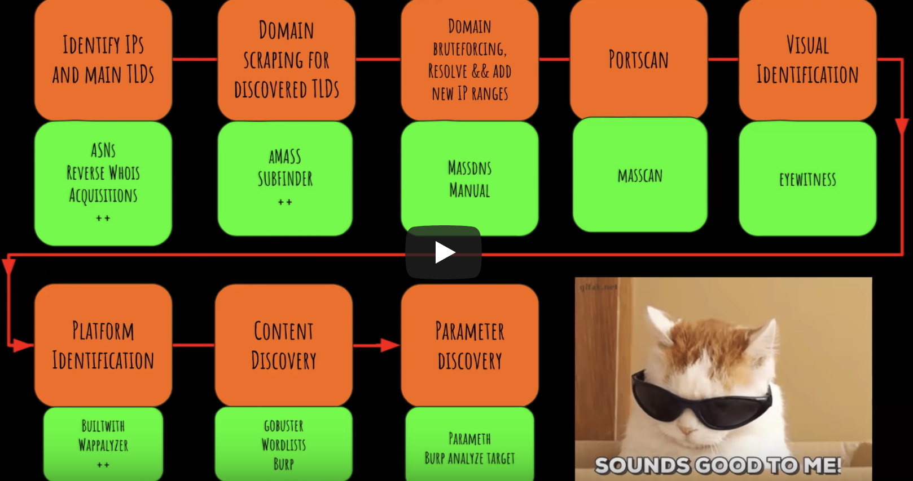

**Sources**
1) https://www.youtube.com/watch?v=Qw1nNPiH_Go
2) https://pentester.land/conference-notes/2018/08/02/levelup-2018-the-bug-hunters-methodology-v3.html
3) (slides) https://docs.google.com/presentation/d/1R-3eqlt31sL7_rj2f1_vGEqqb7hcx4vxX_L7E23lJVo/edit#slide=id.g23d90f19c9_0_50

**Extra sources**
1) https://blog.usejournal.com/bug-hunting-methodology-part-1-91295b2d2066

**NOTE:**
Usage and example data can be found in **source 2** (The writeup). Some extra usage cases and other tools are in **source 3**.

#### Discovering IP space
##### ASN's
When you go after a target you want to look for their hosts and their IP space to get an idea of what exists.

Autonomous System Number

- Hurricane Electric Internet Services
bgp.he.net will give registered IP space for a company. Allows you to search by keyword/company if you don't know their AS number yet or exactly how they registered their company name, you can search by keyword.

##### Arin and RIPE
Next you would like  to look under Arin and RIPE to see information about the organisation. Useful for network pentesting. Also has keyword searches on whois etc.

##### Reverse whois
reverse.report is a website which allows you to reverse whois a domain to find where the domain residers on a specific IP to see what else it belongs to this scope of the company.

##### Shodan
Shodan offers a keyword `org:"telsa motors"` etc to allow search by organisation.

##### Discovering new targets (Wide scope bounty programs)
Many bounty programs have wide scopes which allow testing on all their infrastructure may have some hidden infrastructure.

- Acquisitions
As with the above, often acquisitions take place for companies. We can use wikipedia and crunchbase acquisition section to keep up to date on this.
As wikipedia and Crunchbase are often used for trading stocks, they are often very up to date on these two services.
- Linked discovery
Can use tools like Burp's spidering to check for links to linked services.
- Weighted link and reverse tracker analysis (DomLink and BuiltWith). This is discussed later.

#### Linked discovery
The first thing you want to do once you get a general idea of what a company owns, you want to start visiting the sites themselves for more information.
Linked discovery is an idea of seeing where a site links out to.
The idea is you go to the site in burp, you set up a custom scope and walk/browse the site and it will spider all the hosts recursively as you visit them and fill out your site tree in burp and will show anything that matched your scope's keywords.

**Source video at 14:41 for example**
Walkthrough:
- You may wish to turn off passive scanning when doing this recon in burp as you dont want to generate a ton of results.
- In spider options, we can look at application login. In pentesting you dont want to hit a form which is going to send data to a target for example a form which sends an email to the website owner - we don't want to start spamming them with emails.

For login forms, this is not such an issue. When burp hits an application login normally, handle it as a normal form and use default information for email etc. Pay attention to both **Form submission*8 and **Application login**.

Make this judgement call on your own, identify the types of forms that will be submitted etc.

- Now the spider is configured, we can visit the website and see the spider starting to fill up. At the moment we have no scope setup to filter the list, it grabs everything like google analytics etc, any browser extensions etc.

- To manage this large amount of data we want to add a scope item in the target tag and click use advanced scope control. Now we want to tell burp to match a keyword, not just a strict domain. In our example we can just match the word `tesla` to run a search on all the content and filter anything not matching that keyword.

- Now going back to the sitemap, we can click show only in scope item and it will filter as we set up the scope.

- We can collect some more sites in our tree by manually walking the site.

- Now we want to spider burp using burp's spider which will start spidering all the links we gathered to the scope we defined. We can right click on all the hosts we found and click spider. Now it will send burp's programatic spider out to spider them and all their links and add them to the site tree.

- If we check out the site map we can see the new content highlighted in white (not orange) to show what new sites were found.

- It's useful to search by keyword as not only are we getting specific links but as we're using a keyword instead of domain, we can see third party websites which are related to the target which most likely mention the keyword in it.

#### DomLink
This hasn't worked super well as of yet but a cool new idea is to recursively looking up reverse whois programatically based on who registered a domain and creating a link between those domains and presenting information.
A tool for this is called DomLink which will take an assigned domain, do a whois lookup and from there, based on the registrar will recursively lookup anybody else with the same information.

#### BuiltWith
BuiltWith is a company which manages how websites are run and the analytics etc and does some tracking on domains and their technologies. They offer some free tools for your browser to click and see what tech they're using, ads/analytics/server software/frameworks etc.

Builtwith plugin in browser has some cool features which will link together the relationship of a site based on it's analytics trackers.

In the relationships tab, it will show all analytics codes and will search for other domains in it's database using the same analytics codes. You can click on any of those analytics and it will give a heatmap to show how related it is etc and a full listing of everything that's ever used that analytics tag.

This is very useful for related/in scope services that aren't listed.

#### Others
##### Google dorks
We can use some google dorks, especially using trademarks to find company information. We can use whatever trademark might appear at the bottom of a page in our dorks
Example: `"Tesla © 2016" "Tesla © 2015" "Tesla © 2017" inurl: tesla.com`

#### Finding subdomains
There's two main ways to find subdomains, subdomain scraping and subdomain bruteforcing.
With scraping, it's all about the sources. A tool should have a huge amount of sources such as search engines, robtex, ssl certs, virustotal, wayback machine etc. Scraping is all about the sources which will search a huge amount of sources and can be executed quite quickly.

Before, sublist3r was creat for finding subdomains. Two new tools have emerged.

`Amass` has up to 22 sources it parses from and includes a lot of features for a subdomain enumeration tool. It has reverse DNS, include permuatation scanning, etc.

`subfinder` also contains most of the same sources as amass and also includes features which are superior with output (JSON output example). It also contains a bruteforce option which allows multiple resolvers (like mass DNS, see bruteforcing below). This tried to integrate everything you want to find into one big tool to get subdomains.

Both the above tools are very good and outplays every other tool out there.

##### Old/unused:
- Enumall/ Recon-ng (Not great on sources or speed)
- Aquatone (Not great on sources - aquatone-scan is still useful)
- Sublister (Not great on sources or speed)
- Anything else for Scraping
- Cloudflare enum (Still works - maybe useful)

Note on Aquatone:
*Aquatone is a framework for finding subdomains which has a sort of metasploit style plugin system. The aquatone-finder plugin is what attempts to scan for subdomains which is what really is not up to date anymore. aquatone-scan is the "next step" to run port scanning etc and provide information back. This and other modules in the framework are still useful.*

Note on Cloudflare Enum
*Cloudflare enum still works. When you register cloudflare on a domain they run some magic on their databases to see all the subdomains/records they could find all the subdomains etc t hey could find and offer to set up cloudflare on those. We can use cloudflare's tech to identify possible other targets. Not sure behind the scenes how they're doing it, if they have any better sources etc but unlikely - amass and subfinder should be enough.*

#### Subdomain bruteforcing
The idea is simple, the tools take a wordlist and check if the subdomain exists or not. Often, these can be very slow especially if using a large wordlist like all.txt by jason haddix which is over 1 million lines taken from every subdomain bruteforcing tool possible to find.

**massdns** and **gobuster** are the best options, specifically **massdns**.
massdns will break up your huge list, break it up into a small list and supply this to different DNS resolvers for very fast execution.

*Note:* Subfinder also uses the same idea as massDNS for this. Unsure how useful this is compared to massDNS.

**gobuster** is the best non-multi resolver bruteforcer.

##### Commonspeak
Although all.txt is a very good list for bruteforcing subdomains, commonspeak and scans.io data is also useful.
A tool was written to parse sites and pull out url paths and subdomains it saw from hackernews, httparchive and stackoverflow and check all pages and every time they saw a url path or subdomain they would add it to a list and sort those results in a github repositroy (commonspeak) for them to use.

Generally the subdomain data is very useful and will be added to the all.txt gist. The url data hasn't been very useful as it's very specific per domain and hasn't been particuarly useful.

##### Others
Some other subdomain finding methods are:
- DNSSEC/NSEC/NSEC3 walking
(ldnsutils, nsec3walker, nsec3map)
- Github recon
- Google dorking for ADS key, priv pol, tos, AWS, S3 etc...

### Enumerating targets
Now we have our targets/subdomains, we should start enumerating the targets and running tools against them.

#### Port scanning
A good thing to start with is port scanning. The first idea is to use `nmap` on a target to scan for open ports but generally this is slow and not useful for massive amounts of scans. In most cases nmap will simply take forever and never complete it's task for huge amounts of data.

**Massscan** is the fastest port scanning tool. It won't take DNS names, it will only take IP's.
Below is a small shell script to dig on domain and strip out the ips is below. It can also strip out http/https if pulling out of another tool. Massscan can run against an ip range or main domain. We want to be interested in things with web ports but there's also other ports we want to enumerate too.

```
#!/bin/bash
strip=$(echo $1|sed 's/https\?:\/\///')
echo ""
echo "##################################################"
host $strip
echo "##################################################"
echo ""
masscan -p1-65535 $(dig +short $strip|grep -oE "\b([0-9]{1,3}\.){3}[0-9]{1,3}\b"|head -1)
--max-rate 1000 |& tee $strip_scan
```

#### Credential bruteforce
Now we have run our port scan, we want to start running credential bruteforcing on them.

So far our methodology is Masscan -> NMAP service scan -OG -> Brutespray Credential Bruteforce

Although our bounty is most focused on web, other services may be useful to us and worth investigating. **Brutespray** is useful to take the output of massscan which gives an nmap formatteed output with -og flag. We can then take that nmap format and re-scan that with version scanning from nmap, output that format then pass it to brutespray which looks at remote admin protocols like FTP, SSH, MySQL/MSSQL, it will use a small wordlist to try and bruteforce those with default passwords, anonymous logins, weak passwords etc.

The core bruteforcing module is `medusa`. At the end you'll get a file which says if you managed to bruteforce any hosts etc.

#### Visual identification
A problem with bruteforcing subdomains, particuarly with scraping is that a lot of them may not be up anymore. We have references to them in a format which doesn't show what format is used, http/https etc. We could simply scan for 443 and 80 to determine this but to bypass this extra step, we can get a feel of what each site is by using a tool called **eyewitness**. It will take a list of domains with no protocol, visit each one with a headless browser and take a screenshot and dump them into a report.

We can then determine which domains are redirecting, which are interesting, etc.

The reason we use EyeWitness over other tools is that it will try BOTH protocols (http/https) so we don't need port scanning for this section. We just add a flag `--prepend https` and for every subdomain so we don't need port scanning.

This isn't foolproof. The headless browser tech doesn't always resolve, there's timeout issues etc. Sometimes it just won't work etc. For a large target - we can use eyewitness. When it's small and only have a few hosts, we can just load those manually to check http/https etc and deal with chrome manually.

We can then easily detect what sort of custom applications exist etc.

Eyewitness can be slow, if your scope is small, there's a plugin in chrome called openlist which allows urls to open multiple tabs and implement the visual part faster than eyewitness can.

##### port scanning (non-80 or 443 ports)
There's a list of about 20 standard web ports, that aren't 80/443.

#### Wayback enumeration
Often it is possible to find simple 401/403 basic auth or domain.
You can sometimes go over a URL and search it's wayback entries to see what used to be on that host before it was locked down.
There are many tools like **waybackunifier** **reconcat** **hasone** but **waybackurls** is generally most popular for this.

`@bbuerhaus` on twitter mentioned this method led him to many bounties, normally on old websites that were not properly cleaned up or acquisitions with older code. Wayback also have a json endpoint for easy automation.

### Organisation of data
Now we have a pretty extensive map of a target, we have a lot of data that we need to map out properly. We can use a tool like `xmind` to properly map out information about an organisation. This lets us track our tool usage and track progress across a given bounty.
xmind is a desktop app, the main node being the bounty name which can show in-scope and out of scope  etc with templates.

Can use colour coding to determine our progress on the site.

### Platform identification and CVE searching
We can also check what a website is built with and determine if anything has known vulnerabilities (CVE scan) or if out of date etc.
- Retire.js
Retire.js will go off to a site and look at its libraries and tell if it's out of date and find any associated vulnerabilities.
- Wappalyzer
Stack information like builtwith
- Builtwith
Stack information
- Chrome
- burp-vulners-scanners
This is a burp plugin you install which every time it sees a server header which tells the server version number or it finds a readme file etc to try to find a version number of a framework/web server, it will alert you and tell you as it's version x - here are the CVE's. Similar to retire js but for all of the stack like wordpress/server versions.

### Parsing Javascript
Automation in general doesn't handle parsing javascript so well. Manually you could test every site but this is unreasonably large of a task.
We can use tools such as **ZAP AJAX spider**, **jsparser** and **linkfinder**.
Burp will not execute javascript and it's not so accurate when it comes to parsing Javascript.

For heavy javascript sites, zap's ajax spider will allow you to run a full browser to execute a page so if it's heavily using javascript it will spider with a full headless browser.

This helps with spidering and executing dynamic javascript pages.

We also want to find urls in a page. `linkfinder` is useful for this. Many people have been successful looking at javascript files, parsing them and visiting those urls.
It will go through javascript files, build urls out of absolute urls, relative urls and different formats so you can go visit them.

For example, a javascript file might build urls like `return /reports/ + t + /transfer_eligible_programs`. These can be very difficult for tools like burp to pick out so `linkfinder` will attempt to get this data to you for investigation.

Another tool is `jsparser` but generally linkfinder will do a better job.

#### Feeding javascript parsers
In burp, we can right click any domain in the site tree, click engagement tools (pro only) and click find scripts and once that pops up, click search to get all javascript files and click copy selected URLs and pass them to one of those javascript tools for parsing.

### Content discovery
This is the idea of bruteforcing url patths. `gobuster` is a good choice of tool here. The discussion around content discovery and what to use is normally what list to use.
A list jason haddix created is content_discovery_all.txt on https://gist.github.com/jhaddix/b80ea67d85c13206125806f0828f4d10 .
this is based on `robots disallowed` which is a huge list of places listed in robots.txt.
These are quite old (7 - 8 years) but still very useful. This gist above is combined the raft list, a few custom lists and the robots disallowed list.

Some other lists are **seclists**, **wpscan**, **cmsmap**.

Some other tools are **burp content discovery** **robots disallowed** but **gobuster** is fast and recommended.

### Parameter brutforcing
This is quite untested but quite interesting. Sometimes you have a script which you don't know what parameters it takes and through automation can sometimes tell what parameters are there if you have no parameters referenced anywhere.
**parameth** is the best tool for this task right now.

### Recon Methodology
Below is an example methodology/workflow for beginning to end.


### XSS
Two new things to look out for in XSS are **bXSS** and *ezXSS** which as blind XSS gets more prevalent, you can instrument blind XSS more easily. bXSS is useful as it can even use SMS to text you if blind XSS gets triggered.

### SSRF
When testing against a cloud environment, we can tell what to look for with cloud providers for metadata;
https://gist.github.com/jhaddix/78cece26c91c6263653f31ba453e273b
This gives urls for the internal services which expose metadata. This was cloned and added to from a guy called buffalo will.

### IDOR
One of the most common bug classes currently, severe and common. Keep checking for numeric ID's passed in the URL and anything that looks like a hash/email/id should be investigated to get access to other places.

### Subdomain takeover
**canitakeoverxyz** is a documentation of every service which can or can't be taken over with subdomain takeover and shows information about proceeding with a takeover.

### AWS robbing
If you find s3 buckets and want to take them over, we can use **s3scanner** which allows to give a file with sources of full url, bucket region, domain name or bucket name. Can even throw in keywords to find buckets related.

### Cloudflare or Akamai WAF bypass
Facing cloudflare or Akamai are WAF's which sit in the way of applications. Finding the origins is useful for bypassing these systems.

This is a pain for many bug bounties as you get banned by one of the services and can't get to other services.

Ways to bypass and get to the origin subdomain are to go `origin-sub.domain.com` or `origin.sub.domain.com`.

Other bypasses for these WAF's instead of finding origin are encoding or finding dev. Also often sending `Pragma: akamai-x-get-true-cache-key` the cache key often has the origin in it.

WAF's will often block target.com only so finding stage/dev etc so possible to test on dev.domain.com etc.

Can also use ww1/ww2/ww3.domain.com etc as a waf may not be configured properly for these.

`www.domain.com/jp`
